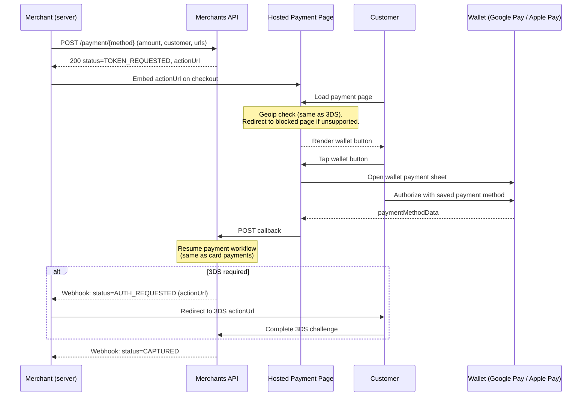
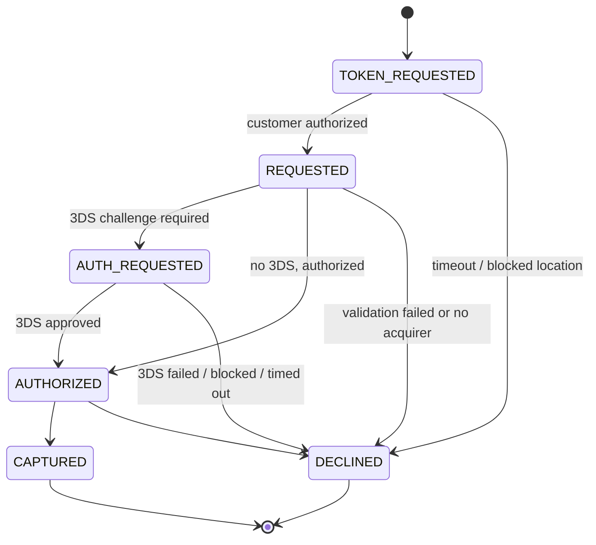

# Alternative Payment Methods

> **Deprecation notice:** The per-method wallet endpoints on this page (`POST /payment/google-pay`, `POST /payment/apple-pay`) belong to the endpoint-per-payment-method model that is being phased out. New integrations must use the single initialize flow — [`POST /payment/crypto/initialize`](crypto-payments.md) — where payment methods are offered to the customer on the hosted payments page. The information below remains relevant for existing integrations.

Alternative Payment Methods (APMs) let you accept payments through a customer's digital wallet without ever handling card data yourself. You initiate the payment server-side and we return a hosted payment page, which you then embed on your checkout. A customer with a valid payment method in their wallet taps the wallet button, completes the sheet, and the platform takes over — the rest follows the standard card-payment workflow, including 3D Secure when required.

The integration is **the same regardless of which APM you use** — only the create endpoint differs. Everything downstream (the hosted page, the lifecycle, webhooks, 3DS handling, and the payment details you read back) is identical.

## Supported methods

| Method     | Create endpoint            | `paymentMethod` value |
|------------|----------------------------|-----------------------|
| Google Pay | `POST /payment/google-pay` | `GOOGLE_PAY`          |
| Apple Pay  | `POST /payment/apple-pay`  | `APPLE_PAY`           |

Both endpoints accept the **same request body** and return the **same response shape**. The payment record carries a `paymentMethod` field (`CARD`, `GOOGLE_PAY`, or `APPLE_PAY`) so you can always tell which method was used for a given payment.

## Integration Flow



Two checks run inside the `TOKEN_REQUESTED` window before an APM payment ever reaches the standard card flow:

- **Location check.** When the customer loads the payment page, we run a geoip check on their IP — the same approach used for [3DS challenges](card-payments.md#id-3d-secure-3ds), just performed earlier in the lifecycle. If their location is unsupported, the page redirects to a blocked-location page and the payment is declined with `RESTRICTED_COUNTRY` — the wallet button is never shown.
- **Authorization window.** If the customer doesn't complete the wallet sheet within the allowed time, the payment is declined (the timeout response code is method-specific — see [Decline reasons](#decline-reasons)).

Once the platform receives the callback from the hosted page, the payment behaves exactly like a regular [card payment](card-payments.md) — same lifecycle, same webhooks, same 3DS handling.

## Create an APM Payment

Send the create request to the endpoint for the method you want. The body is identical across methods and is the same shape as a regular [card payment](card-payments.md#create-a-payment), **with no `card` object** — card data never touches your server.

**Google Pay:**

```bash
curl -X POST https://sandbox-merchants-api.nonprod.paygate.systems/payment/google-pay \
  -H "Authorization: Bearer YOUR_ACCESS_TOKEN" \
  -H "Content-Type: application/json" \
  -d '{
    "externalId": "apm-order-001",
    "currency": "EUR",
    "amount": 29.99,
    "customer": {
      "email": "jane@example.com",
      "firstName": "Jane",
      "lastName": "Doe",
      "billingAddress": {
        "address1": "123 Main St",
        "city": "Berlin",
        "country": "DEU",
        "state": "BE",
        "zip": "10115"
      }
    },
    "successUrl": "https://your-site.com/payment/success",
    "failureUrl": "https://your-site.com/payment/failure"
  }'
```

**Apple Pay** — identical request, sent to the Apple Pay endpoint instead:

```bash
curl -X POST https://sandbox-merchants-api.nonprod.paygate.systems/payment/apple-pay \
  -H "Authorization: Bearer YOUR_ACCESS_TOKEN" \
  -H "Content-Type: application/json" \
  -d '{ "externalId": "apm-order-002", "currency": "EUR", "amount": 29.99, "customer": { ... } }'
```

Everything else (customer, billing address, currency, amount, `externalId`, redirect URLs, metadata) follows the same shape as a regular [card payment](card-payments.md#create-a-payment). See the API reference for the full field list.

### Response

```json
{
  "id": "pay_abc123",
  "externalId": "apm-order-001",
  "status": "TOKEN_REQUESTED",
  "actionUrl": "https://sandbox-merchants-api.nonprod.paygate.systems/public/payments/google-pay/button/eyJhbGciOi..."
}
```

| Field        | Type   | Description                                                                |
|--------------|--------|----------------------------------------------------------------------------|
| `id`         | string | Platform-generated payment ID                                              |
| `externalId` | string | Your provided identifier                                                   |
| `status`     | string | Initial payment status (always `TOKEN_REQUESTED`)                          |
| `actionUrl`  | string | URL of the hosted wallet button page — render this on your checkout        |

The `actionUrl` path reflects the chosen method (for example `/public/payments/google-pay/button/...` or `/public/payments/apple-pay/button/...`).

## Rendering the Button

The `actionUrl` returned by the create call points to a self-contained, statically rendered page that:

1. Loads the wallet's JS library
2. Renders the official wallet button (Google Pay or Apple Pay)
3. Opens the wallet payment sheet when the customer taps it
4. Hands the customer's authorization back to the platform, which then resumes the payment

**Embed it as an iframe on your checkout page:**

```html
<iframe
  src="https://sandbox-merchants-api.nonprod.paygate.systems/public/payments/google-pay/button/eyJhbGciOi..."
  title="Pay"
  style="border: 0; width: 240px; height: 48px;"
  allow="payment">
</iframe>
```

> **Important — `allow="payment"` is mandatory.** Browsers gate the Payment Request API (which both Google Pay and Apple Pay are built on top of) behind the `payment` Permissions-Policy feature. In a cross-origin iframe like this one, the feature is **disabled by default**: without `allow="payment"` on the `<iframe>` tag, the wallet sheet will silently fail to open when the customer taps the button, and your checkout will appear broken with no visible error. Treat this attribute as part of the integration, not a styling choice.

You do **not** need to include the wallet JS SDK, register a merchant ID with the wallet provider, or implement any client-side authorization handler — the hosted page does all of that. You only need to render the iframe (with `allow="payment"`) and wait for webhook updates on the payment.

> **Note:** The `actionUrl` is single-use and bound to the payment ID. It expires when the payment leaves the `TOKEN_REQUESTED` state (after the customer pays, after the timeout window, or once we determine the customer's location is unsupported).

## Payment Lifecycle

An APM payment starts in `TOKEN_REQUESTED` and transitions into the regular card-payment lifecycle as soon as the customer authorizes on the wallet sheet.



| Status            | Description                                                                                |
|-------------------|--------------------------------------------------------------------------------------------|
| `TOKEN_REQUESTED` | Hosted button page is live; the platform is waiting for the customer to authorize the wallet |
| `REQUESTED`       | Customer authorized; standard card-payment processing has begun                            |
| `AUTH_REQUESTED`  | Customer must complete a 3DS challenge (see [3D Secure](card-payments.md#id-3d-secure-3ds))    |
| `AUTHORIZED`      | Card authorized, funds reserved                                                            |
| `CAPTURED`        | Funds captured (terminal, success)                                                         |
| `DECLINED`        | Payment declined (terminal) — inspect `responseCode` for the reason                        |

### Decline reasons

When a payment is declined while still in `TOKEN_REQUESTED`, the `responseCode` field tells you why:

| `responseCode`        | When it is set                                                                  |
|-----------------------|---------------------------------------------------------------------------------|
| *timeout / expiry*    | The customer did not complete the wallet sheet within the allowed window. The exact code is method-specific — `GOOGLE_PAY_EXPIRED` for Google Pay, `APPLE_PAY_EXPIRED` for Apple Pay. |
| `RESTRICTED_COUNTRY`  | The customer's detected location is not supported (checked at button-page load, before the wallet sheet is shown). |
| `INTERNAL_ERROR`      | The platform could not recover a usable payment method from the wallet sheet.   |

In all of these cases, the payment transitions directly from `TOKEN_REQUESTED` to `DECLINED`, a `PAYMENT` webhook is fired, and no card-side processing happens. The customer can retry by creating a new payment.

Declines that occur **after** the customer has authorized (validation failures, 3DS failures, issuer declines, etc.) follow exactly the same conventions as regular [card payments](card-payments.md#payment-lifecycle).

## Webhooks

APM payments emit the standard `PAYMENT` webhook events — there is no separate event type, and the rules are identical to regular [card payments](card-payments.md). Webhooks fire on the key actionable transitions only:

- `AUTH_REQUESTED` — when a 3DS challenge is required (carries the `actionUrl` to redirect the customer to).
- `CAPTURED` — terminal, success.
- `DECLINED` — terminal, failure. Inspect `responseCode` for the reason.

Intermediate transitions such as `TOKEN_REQUESTED → REQUESTED` (when the customer authorizes on the wallet sheet) and `REQUESTED → AUTHORIZED` (when the issuer approves without 3DS) do **not** emit their own webhook. If you need to observe them, poll `GET /payment/{id}`. See [Webhooks](webhooks.md) for setup instructions.

## Get Payment Details

```bash
curl https://sandbox-merchants-api.nonprod.paygate.systems/payment/pay_abc123 \
  -H "Authorization: Bearer YOUR_ACCESS_TOKEN"
```

APM payments are returned by the same [`GET /payment/{id}`](card-payments.md#get-payment-details) endpoint as card payments. The `paymentMethod` field tells you which method was used (`GOOGLE_PAY` or `APPLE_PAY`). Once the customer authorizes, the response also includes the masked card details (`binCode`, `last4`, `issuer`) of the underlying payment method that the wallet returned.

## Testing

To test APM payments in the **sandbox** environment, open the `actionUrl` iframe on a device and browser that support the wallet you are testing, tap the button, and complete the sheet. Observe the payment transition through `TOKEN_REQUESTED → REQUESTED → ... → CAPTURED` via the `CAPTURED` webhook, or by polling `GET /payment/{id}`.

- **Google Pay:** use a Google account enrolled in the [Google Pay TEST environment](https://developers.google.com/pay/api/web/guides/test-and-deploy/integration-checklist) with a test card saved in its Google Wallet, and open the `actionUrl` in Chrome on a device that supports Google Pay.
- **Apple Pay:** Apple Pay testing follows Apple's standard prerequisites — a compatible Apple device with Safari, signed into iCloud with an [Apple Sandbox Tester account](https://developer.apple.com/apple-pay/sandbox-testing/), and one of Apple's test cards provisioned in Wallet. See Apple's official guides for setup and supported test cards: [Apple Pay Sandbox Testing](https://developer.apple.com/apple-pay/sandbox-testing/) and [Apple Pay on the Web](https://developer.apple.com/documentation/apple_pay_on_the_web).

> **Warning:** Only **synthetic (fictitious) data** may be used in the sandbox environment. The use of real personally identifiable information (PII) or real cardholder data (CHD) is **strictly forbidden**.

### Simulating decline outcomes

| To simulate…                  | Do this                                                                                  |
|-------------------------------|------------------------------------------------------------------------------------------|
| Timeout / expiry              | Create a payment and do not interact with the button page; wait for the window to elapse |
| `RESTRICTED_COUNTRY`          | Open the `actionUrl` from an IP in an unsupported region — the page short-circuits at load time and redirects to the blocked-location page before the wallet button is rendered |
| 3DS challenge / failure / issuer declines | Use one of the test cards listed in [Card Payments → Testing](card-payments.md#testing) as the payment method saved in your wallet |
