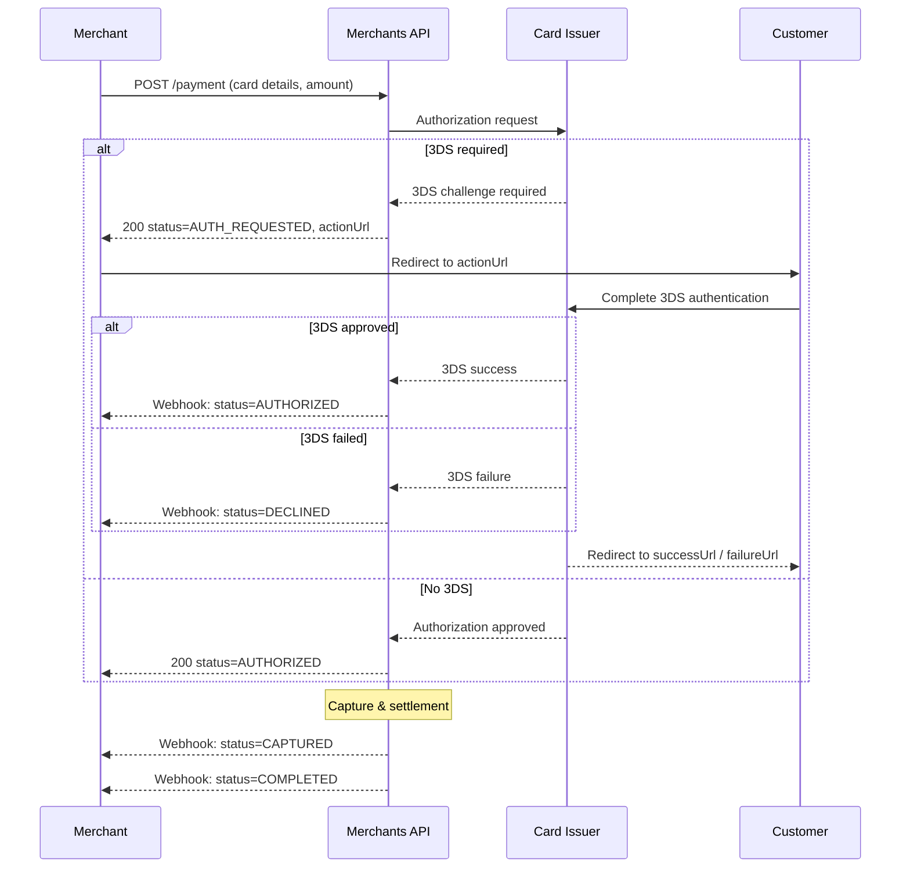
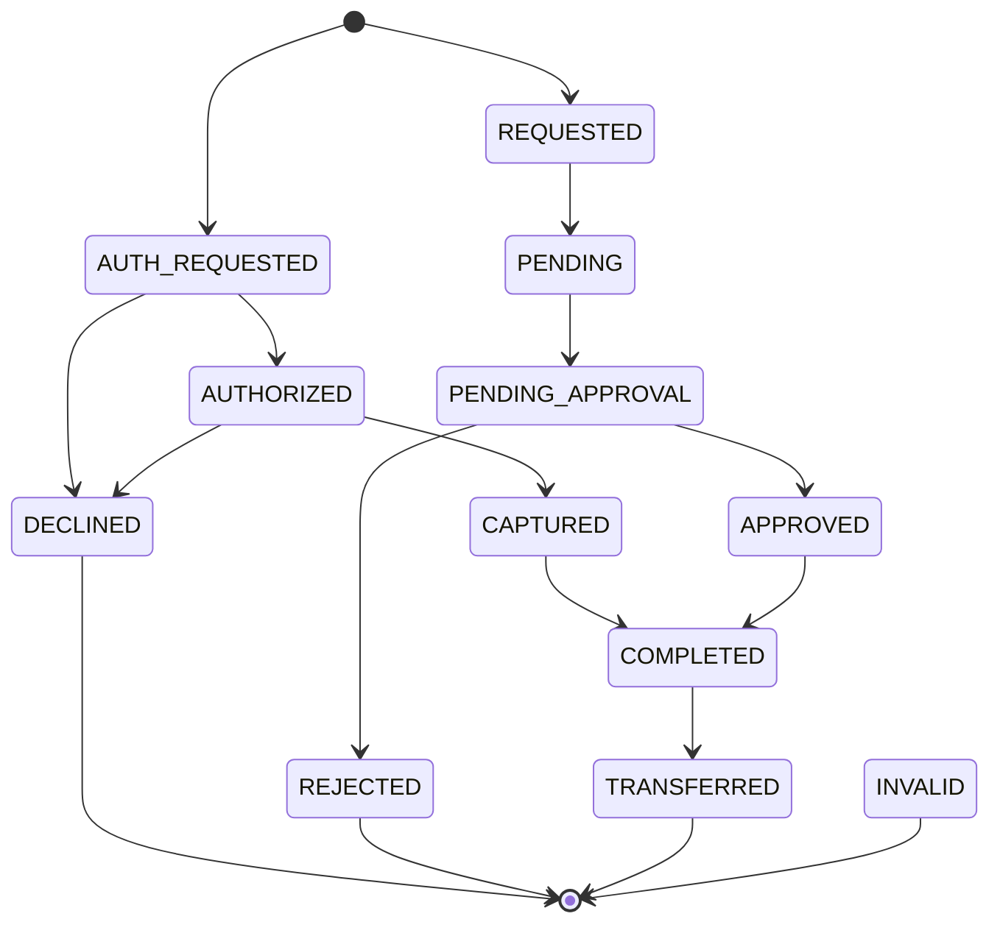
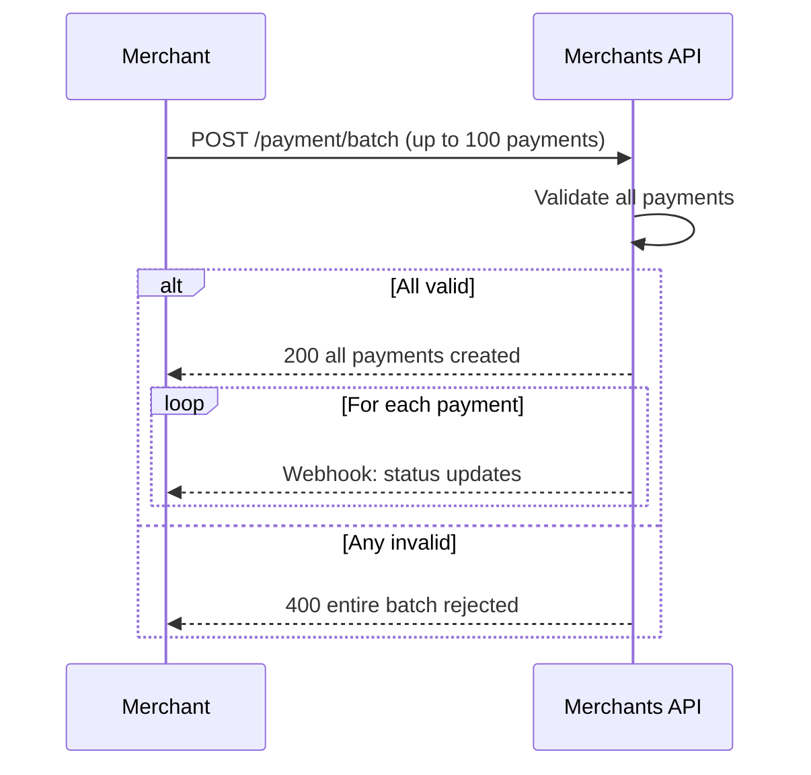
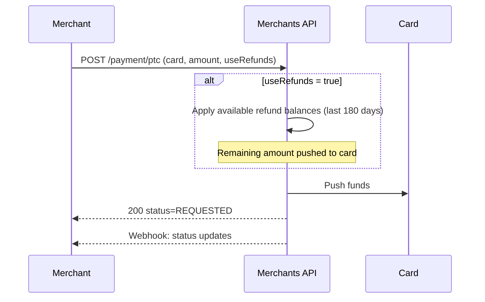

# Card Payments

The Platform Merchants API supports single payments, batch payments, and push-to-card disbursements. All card payment endpoints require a Bearer token (see [Authentication](authentication.md)).

## Card Whitelisting Prerequisite

Depending on your merchant account configuration, cards may need to be [whitelisted](blocklist-and-whitelist.md#card-whitelist) before they can be used for payments. If your account has card whitelisting enabled, you must register each card via the whitelist API and wait for the ~72-hour cooldown period to expire before processing a payment. Payments attempted with non-whitelisted or cooldown-active cards will be declined.

## Single Payment Flow

The following diagram shows the full sequence for creating a card payment, including the optional 3D Secure authentication step:



## Create a Payment

```bash
curl -X POST https://sandbox-merchants-api.nonprod.paygate.systems/payment \
  -H "Authorization: Bearer YOUR_ACCESS_TOKEN" \
  -H "Content-Type: application/json" \
  -d '{
    "externalId": "order-001",
    "currency": "EUR",
    "amount": 29.99,
    "card": {
      "number": "4111111111111111",
      "name": "Jane Doe",
      "expiry": { "month": 12, "year": 2027 },
      "cvc": "123"
    },
    "customer": {
      "email": "jane@example.com",
      "firstName": "Jane",
      "lastName": "Doe",
      "billingAddress": {
        "address1": "123 Main St",
        "city": "Berlin",
        "country": "DEU",
        "state": "BE",
        "zip": "10115"
      }
    }
  }'
```

### Request Fields

| Field                   | Type    | Required | Description                                        |
|-------------------------|---------|----------|----------------------------------------------------|
| `externalId`            | string  | Yes      | Your unique identifier ([details](idempotency.md)) |
| `currency`              | string  | Yes      | ISO 4217 currency code (e.g. `EUR`, `USD`)         |
| `amount`                | number  | Yes      | Amount to charge (minimum `0.01`)                  |
| `card.number`           | string  | Yes      | Full card number                                   |
| `card.name`             | string  | Yes      | Cardholder name as printed on the card             |
| `card.expiry.month`     | integer | Yes      | Expiry month (1–12)                                |
| `card.expiry.year`      | integer | Yes      | Expiry year (4-digit)                              |
| `card.cvc`              | string  | Yes      | Card verification code                             |
| `customer.email`        | string  | Yes      | Customer email address                             |
| `customer.firstName`    | string  | Yes      | Customer first name                                |
| `customer.lastName`     | string  | Yes      | Customer last name                                 |
| `customer.billingAddress` | object | Yes     | Billing address (see below)                        |
| `customer.phone`        | string  | No       | Phone in E.164 format (e.g. `+49170123456`)        |
| `customer.ssn`          | string  | No       | Social security number                             |
| `customerIp`            | string  | No       | Customer's IP address                              |
| `metadata`              | object  | No       | Key-value pairs for your own reference             |
| `successUrl`            | string  | No       | Redirect URL after successful 3DS authentication   |
| `failureUrl`            | string  | No       | Redirect URL after failed 3DS authentication       |

### Billing Address

| Field      | Type   | Required | Description                                  |
|------------|--------|----------|----------------------------------------------|
| `address1` | string | Yes      | Street address line 1                        |
| `address2` | string | No       | Street address line 2                        |
| `city`     | string | Yes      | City                                         |
| `country`  | string | Yes      | ISO 3166-1 alpha-3 country code (e.g. `DEU`) |
| `state`    | string | Yes      | ISO 3166-2 alpha-2 state/region code         |
| `zip`      | string | Yes      | Postal code                                  |

### Response

```json
{
  "id": "pay_abc123",
  "externalId": "order-001",
  "status": "AUTH_REQUESTED",
  "actionUrl": "https://3ds.example.com/auth/xyz"
}
```

| Field       | Type   | Description                                        |
|-------------|--------|----------------------------------------------------|
| `id`        | string | Platform-generated payment ID                      |
| `externalId`| string | Your provided identifier                           |
| `status`    | string | Initial payment status                             |
| `actionUrl` | string | 3DS redirect URL (only present when 3DS is needed) |

### Status Codes

| Code | Meaning                                          |
|------|--------------------------------------------------|
| 200  | Payment created successfully                     |
| 422  | Payment declined                                 |
| 409  | Duplicate `externalId` (see [Idempotency](idempotency.md)) |

## 3D Secure (3DS)

When the payment requires 3D Secure authentication, the response includes an `actionUrl`. You must redirect the customer to this URL to complete the authentication.

After the customer completes 3DS, they are redirected to your `successUrl` or `failureUrl`. The payment status updates accordingly.

If you provided a [webhook](webhooks.md) for `CARD_PAYMENT` events, you will also receive a notification when the payment status changes.

## Confirm a Payment

Some payments may enter a `PENDING` state that requires explicit confirmation.

```bash
curl -X POST https://sandbox-merchants-api.nonprod.paygate.systems/payment/pay_abc123/confirm \
  -H "Authorization: Bearer YOUR_ACCESS_TOKEN"
```

Response:

```json
{
  "id": "pay_abc123",
  "externalId": "order-001",
  "status": "AUTHORIZED"
}
```

## Payment Lifecycle



| Status             | Description                                          |
|--------------------|------------------------------------------------------|
| `AUTH_REQUESTED`   | Payment submitted, awaiting authorization            |
| `AUTHORIZED`       | Card authorized, funds reserved                      |
| `CAPTURED`         | Funds captured from the card                         |
| `COMPLETED`        | Payment fully processed                              |
| `DECLINED`         | Payment was declined by the issuer                   |
| `PENDING`          | Awaiting additional action                           |
| `PENDING_APPROVAL` | Awaiting manual approval                             |
| `APPROVED`         | Manually approved                                    |
| `REJECTED`         | Manually rejected                                    |
| `TRANSFERRED`      | Funds transferred to merchant                        |
| `REQUESTED`        | Payment request submitted                            |
| `INVALID`          | Payment data invalid                                 |

## Get Payment Details

```bash
curl https://sandbox-merchants-api.nonprod.paygate.systems/payment/pay_abc123 \
  -H "Authorization: Bearer YOUR_ACCESS_TOKEN"
```

Returns full payment details including card info (masked), customer, amount, status history, and metadata.

## List Payments

```bash
curl "https://sandbox-merchants-api.nonprod.paygate.systems/payment?limit=20" \
  -H "Authorization: Bearer YOUR_ACCESS_TOKEN"
```

### Query Parameters

| Parameter    | Type    | Default | Description                              |
|--------------|---------|---------|------------------------------------------|
| `limit`      | integer | 20      | Number of results per page (1–100)       |
| `cursor`     | string  | —       | Cursor for the next page of results      |
| `externalId` | string  | —       | Filter by your external identifier       |

The response includes a `nextCursor` field. Pass it as the `cursor` parameter to fetch the next page.

## Batch Payments



Create up to 100 payments in a single atomic request. All payments succeed or none are created.

```bash
curl -X POST https://sandbox-merchants-api.nonprod.paygate.systems/payment/batch \
  -H "Authorization: Bearer YOUR_ACCESS_TOKEN" \
  -H "Content-Type: application/json" \
  -d '{
    "payments": [
      {
        "externalId": "batch-001",
        "currency": "EUR",
        "amount": 10.00,
        "card": { "number": "4111111111111111", "name": "Jane Doe", "expiry": { "month": 12, "year": 2027 }, "cvc": "123" },
        "customer": { "email": "jane@example.com", "firstName": "Jane", "lastName": "Doe", "billingAddress": { "address1": "123 Main St", "city": "Berlin", "country": "DEU", "state": "BE", "zip": "10115" } }
      },
      {
        "externalId": "batch-002",
        "currency": "EUR",
        "amount": 25.00,
        "card": { "number": "5500000000000004", "name": "John Smith", "expiry": { "month": 6, "year": 2028 }, "cvc": "456" },
        "customer": { "email": "john@example.com", "firstName": "John", "lastName": "Smith", "billingAddress": { "address1": "456 Oak Ave", "city": "Munich", "country": "DEU", "state": "BY", "zip": "80331" } }
      }
    ]
  }'
```

### Batch Rules

- Maximum **100 payments** per batch.
- Every `externalId` in the batch must be unique (no duplicates within the batch or with existing payments).
- The operation is **atomic**: if any payment fails validation, the entire batch is rejected.

### Status Codes

| Code | Meaning                                     |
|------|---------------------------------------------|
| 200  | All payments created successfully            |
| 400  | Invalid request or batch size exceeded       |
| 409  | Duplicate `externalId` conflict              |

## Push-to-Card



Push funds directly to a customer's card. This is useful for disbursements, payouts, or refunds to a different card.

```bash
curl -X POST https://sandbox-merchants-api.nonprod.paygate.systems/payment/ptc \
  -H "Authorization: Bearer YOUR_ACCESS_TOKEN" \
  -H "Content-Type: application/json" \
  -d '{
    "externalId": "payout-001",
    "currency": "EUR",
    "amount": 50.00,
    "card": {
      "number": "4111111111111111",
      "name": "Jane Doe",
      "expiry": { "month": 12, "year": 2027 },
      "cvc": "123"
    },
    "useRefunds": true
  }'
```

### Request Fields

| Field        | Type    | Required | Description                                              |
|--------------|---------|----------|----------------------------------------------------------|
| `externalId` | string  | Yes      | Your unique identifier                                   |
| `currency`   | string  | Yes      | ISO 4217 currency code                                   |
| `amount`     | number  | Yes      | Amount to push (minimum `0.01`)                          |
| `card`       | object  | Yes      | Recipient card details                                   |
| `useRefunds` | boolean | Yes      | Use available refunds from the last 180 days first       |
| `metadata`   | object  | No       | Key-value pairs for your own reference                   |

When `useRefunds` is `true`, the platform first applies any available refund balances from the last 180 days before pushing the remaining amount to the card.

### Response

```json
{
  "id": "ptc_xyz789",
  "externalId": "payout-001",
  "status": "REQUESTED",
  "message": "Push-to-card payment initiated"
}
```

## Testing

> **Warning:** Only **synthetic (fictitious) data** may be used in the sandbox environment. The use of real personally identifiable information (PII) or real cardholder data (CHD) is **strictly forbidden**. Always use the test card numbers listed below along with fabricated customer details (names, emails, addresses).

Use the following test card numbers in the **sandbox** environment to simulate different payment outcomes. All test cards can use any future expiry date and any 3-digit CVC.

### Visa — Approved

| Card Number          | Outcome            |
|----------------------|--------------------|
| `4761344136141390`   | Approved           |
| `4761201381475297`   | Approved           |
| `4159129252458086`   | Approved           |
| `4123407439043051`   | Approved           |
| `4001888687412469`   | Approved           |
| `4444493318246892`   | Approved           |
| `4000287447386587`   | Approved (debit)   |

### Visa — Declined

| Card Number          | Reason                          |
|----------------------|---------------------------------|
| `4008370896662369`   | General decline                 |
| `4008384424370890`   | Insufficient funds              |
| `4000157454627969`   | Lost/stolen card                |
| `4000247422310226`   | Expired card                    |
| `4000254588011960`   | Transaction not permitted       |
| `4000203016321921`   | Invalid transaction             |
| `4000189336416410`   | Exceeds withdrawal limit        |
| `4000196948974975`   | Exceeds withdrawal frequency    |
| `4000273652260030`   | Restricted card                 |
| `4000229544877670`   | Issuer/switch inoperative       |
| `4000234977370839`   | Timeout                         |
| `4000128449498204`   | External processing error       |
| `4000212384978055`   | Format error                    |

### Visa — 3D Secure

| Card Number          | Outcome                                  |
|----------------------|------------------------------------------|
| `4000020951595032`   | 3DS approved (frictionless)              |
| `4000027891380961`   | 3DS approved (with fingerprinting)       |
| `4000319872807223`   | 3DS declined                             |
| `4567491000001113`   | Frictionless flow (use amount `83.10`)   |
| `4567491000002228`   | Challenge flow (use amount `115.20`)     |

### Mastercard — Approved

| Card Number          | Outcome            |
|----------------------|--------------------|
| `5101081046006034`   | Approved           |
| `5101084411423750`   | Approved           |
| `5333304500657872`   | Approved           |
| `5333308664112277`   | Approved           |
| `5550345228382224`   | Approved           |
| `5550347471347813`   | Approved           |
| `2222755234426838`   | Approved           |
| `2221004483162815`   | Approved           |

### Mastercard — Declined

| Card Number          | Reason                          |
|----------------------|---------------------------------|
| `5333418445863914`   | General decline                 |
| `5001638548736201`   | General decline                 |
| `5333475572200849`   | Insufficient funds              |
| `5333452804487502`   | Lost/stolen card                |
| `5333540337444022`   | Expired card                    |
| `5333554636535091`   | Transaction not permitted       |
| `5333502383316074`   | Invalid transaction             |
| `5333482348715142`   | Exceeds withdrawal limit        |
| `5333498929343773`   | Exceeds withdrawal frequency    |
| `5333578626428553`   | Restricted card                 |
| `5333527145351713`   | Issuer/switch inoperative       |
| `5333532915594096`   | Timeout                         |
| `5333423768173347`   | External processing error       |
| `5333518577223892`   | Format error                    |
| `5333583123003909`   | Invalid CVV                     |
| `5333463046218753`   | Do not honor                    |

### Mastercard — 3D Secure

| Card Number          | Outcome                                  |
|----------------------|------------------------------------------|
| `5333302221254276`   | 3DS approved (frictionless)              |
| `2221008123677736`   | 3DS approved (with fingerprinting)       |
| `5333418445863914`   | 3DS declined                             |
| `5545060700001113`   | Frictionless flow (use amount `83.10`)   |
| `5545060700002228`   | Challenge flow (use amount `115.20`)     |

### Testing Tips

- Use any future expiry date (e.g. `12/2027`) and any 3-digit CVC (e.g. `123`).
- For 3DS challenge/frictionless flow cards, use the specific amounts noted in the table to trigger the expected behavior.
- Provide `successUrl` and `failureUrl` when testing 3DS flows so you can observe the redirect behavior.
- Use a unique `externalId` for each test payment to avoid `409 Conflict` errors.
