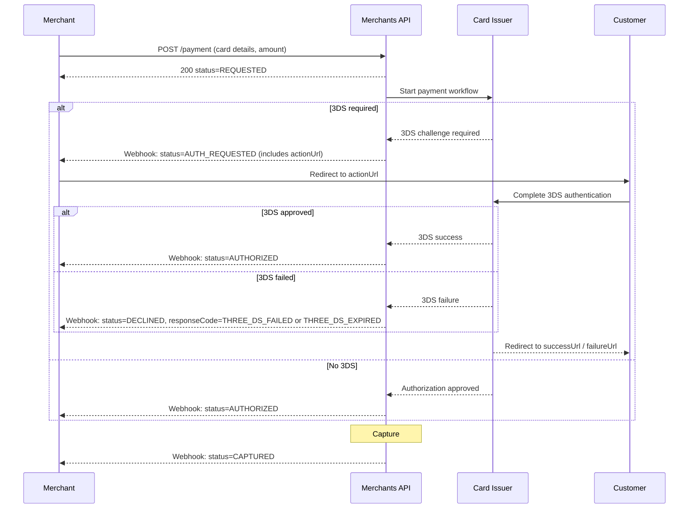
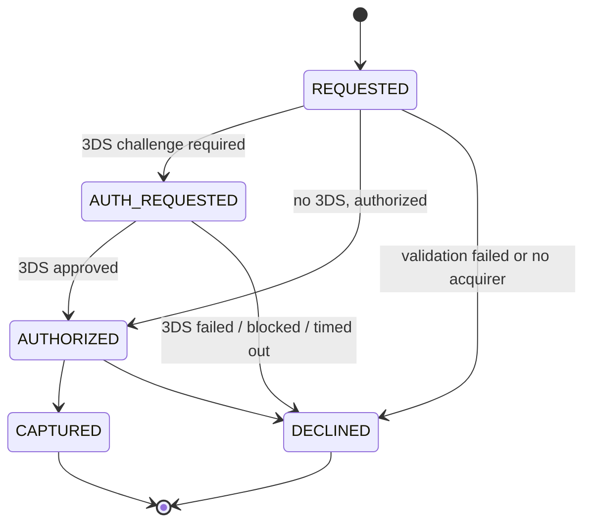
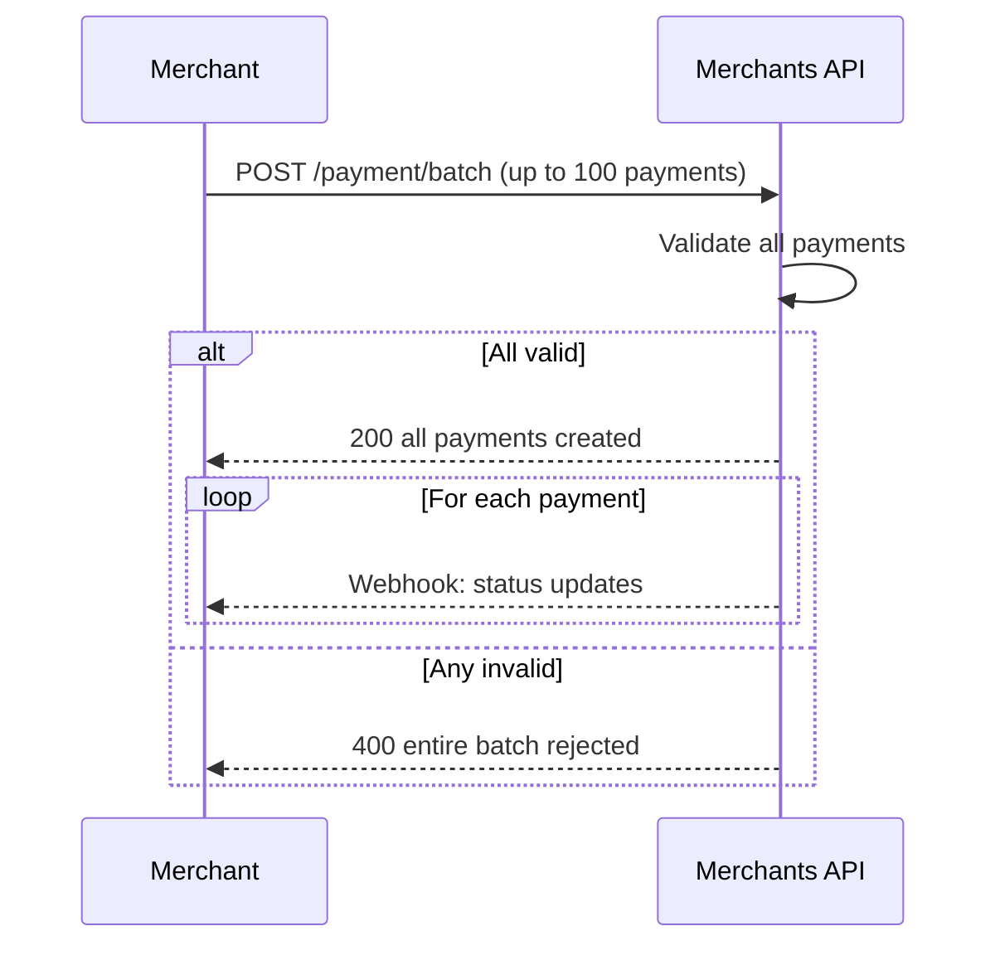
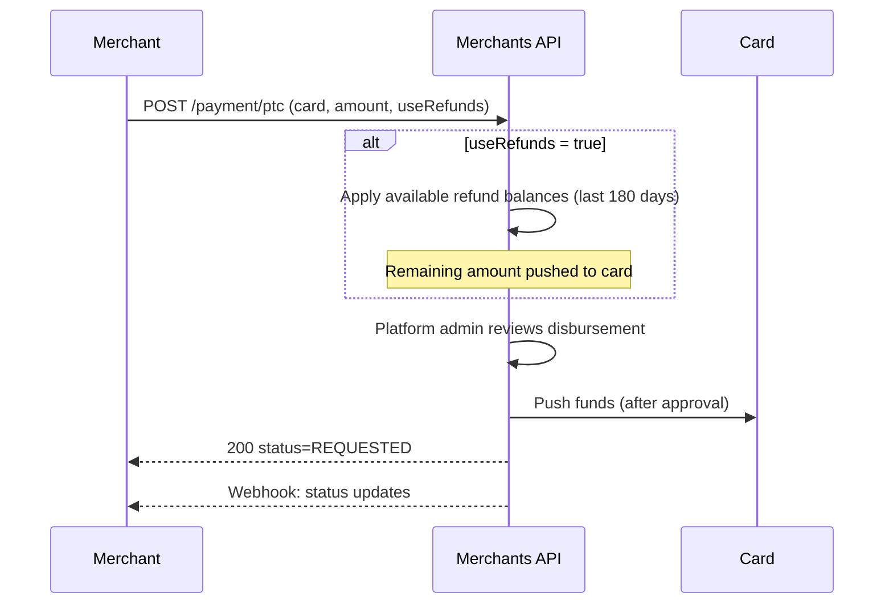
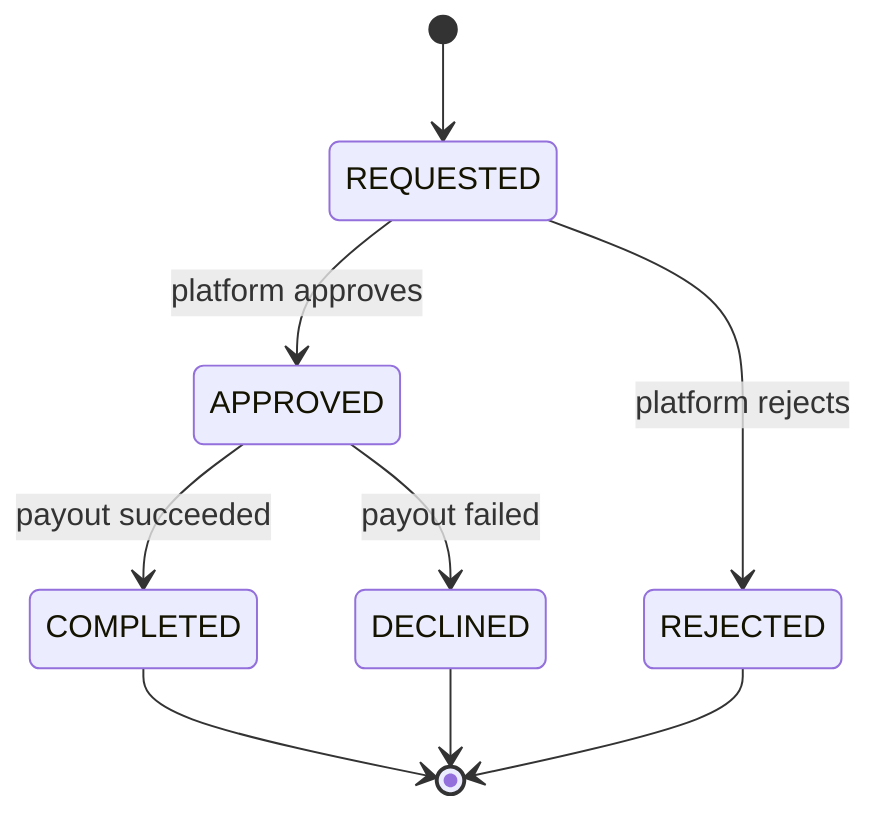

# Card Payments

The Platform Merchants API supports single payments, batch payments, and push-to-card disbursements. All card payment endpoints require a Bearer token (see [Authentication](authentication.md)).

## Card Whitelisting Prerequisite

Depending on your merchant account configuration, cards may need to be [whitelisted](blocklist-and-whitelist.md#card-whitelist) before they can be used for payments. If your account has card whitelisting enabled, you must register each card via the whitelist API and wait for the ~72-hour cooldown period to expire before processing a payment. Payments attempted with non-whitelisted or cooldown-active cards will be declined.

## Single Payment Flow

The following diagram shows the full sequence for creating a card payment, including the optional 3D Secure authentication step:


```mermaid
sequenceDiagram
    participant M as Merchant
    participant API as Merchants API
    participant I as Card Issuer
    participant C as Customer

    M->>API: POST /payment (card details, amount)
    API-->>M: 200 status=REQUESTED
    API->>I: Start payment workflow
    alt 3DS required
        I-->>API: 3DS challenge required
        API-->>M: Webhook: status=AUTH_REQUESTED (includes actionUrl)
        M->>C: Redirect to actionUrl
        C->>I: Complete 3DS authentication
        alt 3DS approved
            I-->>API: 3DS success
            API-->>M: Webhook: status=AUTHORIZED
        else 3DS failed
            I-->>API: 3DS failure
            API-->>M: Webhook: status=DECLINED, responseCode=THREE_DS_FAILED or THREE_DS_EXPIRED
        end
        I-->>C: Redirect to successUrl / failureUrl
    else No 3DS
        I-->>API: Authorization approved
        API-->>M: Webhook: status=AUTHORIZED
    end
    Note over API: Capture
    API-->>M: Webhook: status=CAPTURED
```

## Create a Payment

```bash
curl -X POST https://sandbox-merchants-api.nonprod.paygate.systems/payment \
  -H "Authorization: Bearer YOUR_ACCESS_TOKEN" \
  -H "Content-Type: application/json" \
  -d '{
    "externalId": "order-001",
    "currency": "EUR",
    "amount": 29.99,
    "card": {
      "number": "4111111111111111",
      "name": "Jane Doe",
      "expiry": { "month": 12, "year": 2027 },
      "cvc": "123"
    },
    "customer": {
      "email": "jane@example.com",
      "firstName": "Jane",
      "lastName": "Doe",
      "billingAddress": {
        "address1": "123 Main St",
        "city": "Berlin",
        "country": "DEU",
        "state": "BE",
        "zip": "10115"
      }
    }
  }'
```

### Request Fields

| Field                   | Type    | Required | Description                                        |
|-------------------------|---------|----------|----------------------------------------------------|
| `externalId`            | string  | Yes      | Your unique identifier ([details](idempotency.md)) |
| `currency`              | string  | Yes      | ISO 4217 currency code (e.g. `EUR`, `USD`)         |
| `amount`                | number  | Yes      | Amount to charge (minimum `0.01`)                  |
| `card.number`           | string  | Yes      | Full card number                                   |
| `card.name`             | string  | Yes      | Cardholder name as printed on the card             |
| `card.expiry.month`     | integer | Yes      | Expiry month (1–12)                                |
| `card.expiry.year`      | integer | Yes      | Expiry year (4-digit)                              |
| `card.cvc`              | string  | Yes      | Card verification code                             |
| `customer.email`        | string  | Yes      | Customer email address                             |
| `customer.firstName`    | string  | Yes      | Customer first name                                |
| `customer.lastName`     | string  | Yes      | Customer last name                                 |
| `customer.billingAddress` | object | Yes     | Billing address (see below)                        |
| `customer.phone`        | string  | No       | Phone in E.164 format (e.g. `+49170123456`)        |
| `customer.ssn`          | string  | No       | Social security number                             |
| `customerIp`            | string  | No       | Customer's IP address                              |
| `metadata`              | object  | No       | Key-value pairs for your own reference             |
| `successUrl`            | string  | No       | Redirect URL after successful 3DS authentication   |
| `failureUrl`            | string  | No       | Redirect URL after failed 3DS authentication       |

### Billing Address

| Field      | Type   | Required | Description                                  |
|------------|--------|----------|----------------------------------------------|
| `address1` | string | Yes      | Street address line 1                        |
| `address2` | string | No       | Street address line 2                        |
| `city`     | string | Yes      | City                                         |
| `country`  | string | Yes      | ISO 3166-1 alpha-3 country code (e.g. `DEU`) |
| `state`    | string | Yes      | ISO 3166-2 alpha-2 state/region code         |
| `zip`      | string | Yes      | Postal code                                  |

### Response

```json
{
  "id": "pay_abc123",
  "externalId": "order-001",
  "status": "REQUESTED"
}
```

| Field       | Type   | Description                                        |
|-------------|--------|----------------------------------------------------|
| `id`        | string | Platform-generated payment ID                      |
| `externalId`| string | Your provided identifier                           |
| `status`    | string | Initial payment status (always `REQUESTED`)        |

### Status Codes

| Code | Meaning                                          |
|------|--------------------------------------------------|
| 200  | Payment created successfully                     |
| 422  | Payment declined                                 |
| 409  | Duplicate `externalId` (see [Idempotency](idempotency.md)) |

## 3D Secure (3DS)

When a payment is created, it starts in `REQUESTED` status and the payment workflow begins. If the platform determines that 3D Secure authentication is required, the payment status changes to `AUTH_REQUESTED`. `AUTH_REQUESTED` is set **only** to inform the merchant that the customer must complete a 3DS challenge — it never appears on payments that don't go through 3DS, and never on refunds, chargebacks, or push-to-card.

The 3DS challenge URL (`actionUrl`) is delivered via a [webhook](webhooks.md) notification for `CARD_PAYMENT` events. It is also available by calling [GET /payment/{id}](#get-payment-details). The `actionUrl` is **never** included in the create payment response.

Once you receive the `actionUrl`, redirect the customer to complete the 3DS challenge. After authentication, the customer is redirected to your `successUrl` or `failureUrl`, and the payment status updates accordingly via webhook.

### 3DS failure outcomes

There is no dedicated payment status for 3DS failure or 3DS expiry. When a 3DS challenge does not succeed, the payment transitions to `DECLINED` and the `responseCode` field on the payment carries the specific reason. Two `responseCode` values are 3DS-specific:

| `responseCode`     | When it is set                                                                                       |
|--------------------|------------------------------------------------------------------------------------------------------|
| `THREE_DS_FAILED`  | The 3DS challenge failed — authentication was unsuccessful, the issuer rejected the challenge, or the customer was blocked. |
| `THREE_DS_EXPIRED` | The 3DS challenge timed out — the customer did not complete authentication within the allowed time.    |

Both values arrive together with `status: DECLINED`, on the same `CARD_PAYMENT` webhook that signals the decline (and on `GET /payment/{id}`). To recognise a 3DS-related decline programmatically, check `status == DECLINED` **and** `responseCode in {THREE_DS_FAILED, THREE_DS_EXPIRED}`. The customer can usually retry by submitting a new payment.

## Payment Lifecycle

This is the lifecycle of a single card payment created via `POST /payment`. Refunds, chargebacks, and push-to-card disbursements have their own lifecycles — see [Refunds](refunds.md) and [Push-to-Card Lifecycle](#push-to-card-lifecycle).


```mermaid
stateDiagram-v2
    [*] --> REQUESTED
    REQUESTED --> AUTH_REQUESTED: 3DS challenge required
    REQUESTED --> AUTHORIZED: no 3DS, authorized
    REQUESTED --> DECLINED: validation failed or no acquirer
    AUTH_REQUESTED --> AUTHORIZED: 3DS approved
    AUTH_REQUESTED --> DECLINED: 3DS failed / blocked / timed out
    AUTHORIZED --> CAPTURED
    AUTHORIZED --> DECLINED
    CAPTURED --> [*]
    DECLINED --> [*]
```

| Status           | Description                                                                  |
|------------------|------------------------------------------------------------------------------|
| `REQUESTED`      | Payment created and being processed                                          |
| `AUTH_REQUESTED` | Customer must complete a 3DS challenge (set only when 3D Secure is required) |
| `AUTHORIZED`     | Card authorized, funds reserved                                              |
| `CAPTURED`       | Funds captured from the card (terminal, success)                             |
| `DECLINED`       | Payment declined by the issuer or platform (terminal). For 3DS-specific declines, inspect `responseCode` (see [3DS failure outcomes](#3ds-failure-outcomes)). |

## Get Payment Details

```bash
curl https://sandbox-merchants-api.nonprod.paygate.systems/payment/pay_abc123 \
  -H "Authorization: Bearer YOUR_ACCESS_TOKEN"
```

Returns full payment details including card info (masked), customer, amount, status history, and metadata.

## List Payments

```bash
curl "https://sandbox-merchants-api.nonprod.paygate.systems/payment?limit=20" \
  -H "Authorization: Bearer YOUR_ACCESS_TOKEN"
```

### Query Parameters

| Parameter    | Type    | Default | Description                              |
|--------------|---------|---------|------------------------------------------|
| `limit`      | integer | 20      | Number of results per page (1–100)       |
| `cursor`     | string  | —       | Cursor for the next page of results      |
| `externalId` | string  | —       | Filter by your external identifier       |

The response includes a `nextCursor` field. Pass it as the `cursor` parameter to fetch the next page.

## Batch Payments


```mermaid
sequenceDiagram
    participant M as Merchant
    participant API as Merchants API

    M->>API: POST /payment/batch (up to 100 payments)
    API->>API: Validate all payments
    alt All valid
        API-->>M: 200 all payments created
        loop For each payment
            API-->>M: Webhook: status updates
        end
    else Any invalid
        API-->>M: 400 entire batch rejected
    end
```

Create up to 100 payments in a single atomic request. All payments succeed or none are created. Each payment in the batch follows the [single-payment lifecycle](#payment-lifecycle).

```bash
curl -X POST https://sandbox-merchants-api.nonprod.paygate.systems/payment/batch \
  -H "Authorization: Bearer YOUR_ACCESS_TOKEN" \
  -H "Content-Type: application/json" \
  -d '{
    "payments": [
      {
        "externalId": "batch-001",
        "currency": "EUR",
        "amount": 10.00,
        "card": { "number": "4111111111111111", "name": "Jane Doe", "expiry": { "month": 12, "year": 2027 }, "cvc": "123" },
        "customer": { "email": "jane@example.com", "firstName": "Jane", "lastName": "Doe", "billingAddress": { "address1": "123 Main St", "city": "Berlin", "country": "DEU", "state": "BE", "zip": "10115" } }
      },
      {
        "externalId": "batch-002",
        "currency": "EUR",
        "amount": 25.00,
        "card": { "number": "5500000000000004", "name": "John Smith", "expiry": { "month": 6, "year": 2028 }, "cvc": "456" },
        "customer": { "email": "john@example.com", "firstName": "John", "lastName": "Smith", "billingAddress": { "address1": "456 Oak Ave", "city": "Munich", "country": "DEU", "state": "BY", "zip": "80331" } }
      }
    ]
  }'
```

### Batch Rules

- Maximum **100 payments** per batch.
- Every `externalId` in the batch must be unique (no duplicates within the batch or with existing payments).
- The operation is **atomic**: if any payment fails validation, the entire batch is rejected.

### Status Codes

| Code | Meaning                                     |
|------|---------------------------------------------|
| 200  | All payments created successfully            |
| 400  | Invalid request or batch size exceeded       |
| 409  | Duplicate `externalId` conflict              |

## Push-to-Card


```mermaid
sequenceDiagram
    participant M as Merchant
    participant API as Merchants API
    participant C as Card

    M->>API: POST /payment/ptc (card, amount, useRefunds)
    alt useRefunds = true
        API->>API: Apply available refund balances (last 180 days)
        Note over API: Remaining amount pushed to card
    end
    API->>API: Platform admin reviews disbursement
    API->>C: Push funds (after approval)
    API-->>M: 200 status=REQUESTED
    API-->>M: Webhook: status updates
```

Push funds directly to a customer's card. This is useful for disbursements, payouts, or refunds to a different card.

> **Note:** Push-to-card disbursements always require platform-administration review before funds are sent. The payment stays in `REQUESTED` until the platform approves or rejects it.

```bash
curl -X POST https://sandbox-merchants-api.nonprod.paygate.systems/payment/ptc \
  -H "Authorization: Bearer YOUR_ACCESS_TOKEN" \
  -H "Content-Type: application/json" \
  -d '{
    "externalId": "payout-001",
    "currency": "EUR",
    "amount": 50.00,
    "card": {
      "number": "4111111111111111",
      "name": "Jane Doe",
      "expiry": { "month": 12, "year": 2027 },
      "cvc": "123"
    },
    "useRefunds": true
  }'
```

### Request Fields

| Field        | Type    | Required | Description                                              |
|--------------|---------|----------|----------------------------------------------------------|
| `externalId` | string  | Yes      | Your unique identifier                                   |
| `currency`   | string  | Yes      | ISO 4217 currency code                                   |
| `amount`     | number  | Yes      | Amount to push (minimum `0.01`)                          |
| `card`       | object  | Yes      | Recipient card details                                   |
| `useRefunds` | boolean | Yes      | Use available refunds from the last 180 days first       |
| `metadata`   | object  | No       | Key-value pairs for your own reference                   |

When `useRefunds` is `true`, the platform first applies any available refund balances from the last 180 days before pushing the remaining amount to the card.

### Response

```json
{
  "id": "ptc_xyz789",
  "externalId": "payout-001",
  "status": "REQUESTED",
  "message": "Push-to-card payment initiated"
}
```

### Push-to-Card Lifecycle

Push-to-card disbursements use a different state machine from card payments. They never go through 3D Secure, so `AUTH_REQUESTED`, `AUTHORIZED`, and `CAPTURED` do not apply.


```mermaid
stateDiagram-v2
    [*] --> REQUESTED
    REQUESTED --> APPROVED: platform approves
    REQUESTED --> REJECTED: platform rejects
    APPROVED --> COMPLETED: payout succeeded
    APPROVED --> DECLINED: payout failed
    COMPLETED --> [*]
    DECLINED --> [*]
    REJECTED --> [*]
```

| Status      | Description                                                  |
|-------------|--------------------------------------------------------------|
| `REQUESTED` | Disbursement created, awaiting platform-administration review |
| `APPROVED`  | Approved by platform admin, sent to the payout processor     |
| `REJECTED`  | Rejected by platform admin during review (terminal)          |
| `COMPLETED` | Funds successfully pushed to the card (terminal, success)    |
| `DECLINED`  | Payout failed at the processor (terminal)                    |

## Testing

> **Warning:** Only **synthetic (fictitious) data** may be used in the sandbox environment. The use of real personally identifiable information (PII) or real cardholder data (CHD) is **strictly forbidden**.

Use the following test card numbers in the **sandbox** environment to simulate different payment outcomes. Each test card requires the **exact card number, expiry date, and cardholder name** shown in the table — the platform validates all three fields. Any other combination returns `400 Bad Request` with `"card is not valid for test payments"`.

The CVC field accepts any valid 3-digit value.

### Visa — Approved

| Card Number          | Expiry    | Cardholder        | Notes                 |
|----------------------|-----------|-------------------|-----------------------|
| `4000000000002701`   | `12/2032` | `Jane Smith`      | Visa                  |
| `4000000000004970`   | `12/2032` | `Jane Smith`      | Cartes Bancaires Visa |
| `4244951901005043`   | `08/2034` | `Sophia Turner`   |                       |
| `4263704637473241`   | `10/2035` | `Noah Whitaker`   |                       |
| `4761344136141390`   | `12/2027` | `Jane Smith`      | Debit (SG)            |
| `4761261512059089`   | `12/2027` | `Jane Smith`      | Debit (CA)            |
| `4159129252458086`   | `12/2027` | `Jane Smith`      | Credit (SV)           |
| `4001888687412469`   | `12/2027` | `Jane Smith`      | Credit (DE)           |
| `4001887232273343`   | `12/2027` | `Jane Smith`      | Credit (DE)           |
| `4444493318246892`   | `12/2027` | `Jane Smith`      | Credit (MX)           |
| `4815163523263534`   | `12/2027` | `Jane Smith`      | Debit (MX)            |
| `4000287447386587`   | `12/2027` | `Jane Smith`      | Debit (US)            |
| `4149124711257917`   | `12/2027` | `Jane Smith`      |                       |
| `4462030000000000`   | `01/2035` | `John Smith`      |                       |
| `4111111111111111`   | `01/2035` | `Jane Smith`      |                       |

### Visa — Declined

| Card Number          | Expiry    | Cardholder   | Reason             |
|----------------------|-----------|--------------|--------------------|
| `4000000000002701`   | `12/2028` | `REFUSED`    | General decline    |
| `4000000000004970`   | `12/2028` | `REFUSED`    | General decline    |
| `4008370896662369`   | `12/2027` | `Jane Smith` | General decline    |
| `4111111111111105`   | `01/2035` | `Jane Smith` | Do not honor       |
| `4111111111111143`   | `01/2035` | `Jane Smith` | Stolen card        |
| `4111111111111151`   | `01/2035` | `Jane Smith` | Insufficient funds |

### Mastercard — Approved

| Card Number          | Expiry    | Cardholder        | Notes       |
|----------------------|-----------|-------------------|-------------|
| `5200000000002235`   | `11/2033` | `John Smith`      |             |
| `5221744250525131`   | `07/2036` | `Charlotte Hayes` |             |
| `5550345228382224`   | `12/2027` | `Jane Smith`      | Credit (ZA) |
| `5550347471347813`   | `12/2027` | `Jane Smith`      | Credit (ZA) |
| `5550343875851690`   | `12/2027` | `Jane Smith`      | Credit (ZA) |
| `5333395610225642`   | `12/2027` | `Jane Smith`      | Credit (HN) |
| `5203821142568313`   | `12/2027` | `Jane Smith`      | Credit (CN) |
| `5256787172322309`   | `12/2027` | `Jane Smith`      | Debit (MX)  |
| `5579103297518880`   | `12/2027` | `Jane Smith`      | Debit (MX)  |
| `5413037340736315`   | `12/2027` | `Jane Smith`      | Credit (DK) |
| `5333378415223095`   | `12/2027` | `Jane Smith`      | Credit (KR) |

### Mastercard — Declined

| Card Number          | Expiry    | Cardholder   | Reason          |
|----------------------|-----------|--------------|-----------------|
| `5200000000002235`   | `12/2028` | `REFUSED`    | General decline |

### AMEX — Approved

| Card Number       | Expiry    | Cardholder   |
|-------------------|-----------|--------------|
| `340000000002708` | `12/2030` | `Jane Smith` |

### AMEX — Declined

| Card Number       | Expiry    | Cardholder |
|-------------------|-----------|------------|
| `340000000002708` | `12/2028` | `REFUSED`  |

### Discover / Diners — Approved

| Card Number        | Expiry    | Cardholder   |
|--------------------|-----------|--------------|
| `6011000000002117` | `12/2030` | `Jane Smith` |

### Discover / Diners — Declined

| Card Number        | Expiry    | Cardholder |
|--------------------|-----------|------------|
| `6011000000002117` | `12/2028` | `REFUSED`  |

### JCB — Approved

| Card Number        | Expiry    | Cardholder   |
|--------------------|-----------|--------------|
| `3338000000000296` | `12/2030` | `Jane Smith` |

### JCB — Declined

| Card Number        | Expiry    | Cardholder |
|--------------------|-----------|------------|
| `3338000000000296` | `12/2028` | `REFUSED`  |

### 3D Secure

| Card Number        | Expiry    | Cardholder | Outcome                         |
|--------------------|-----------|------------|---------------------------------|
| `2221008123677736` | `12/2027` | `CL-BRW2`  | 3DS Mastercard (challenge flow) |
| `5353029602254618` | `12/2027` | `FL-BRW1`  | 3DS Mastercard AFT              |

### Testing Tips

- Each test card requires the **exact** expiry date and cardholder name shown in the table. Using any other value returns `400 Bad Request` with `"card is not valid for test payments"`.
- Cardholder name matching is **case-insensitive** — `"jane smith"` and `"JANE SMITH"` both work where the table shows `Jane Smith`.
- The CVC field accepts any 3-digit value (e.g. `123`).
- Google Pay and Apple Pay payments are not subject to test card validation.
- Provide `successUrl` and `failureUrl` when testing 3DS flows so you can observe the redirect behaviour.
- Use a unique `externalId` for each test payment to avoid `409 Conflict` errors.
