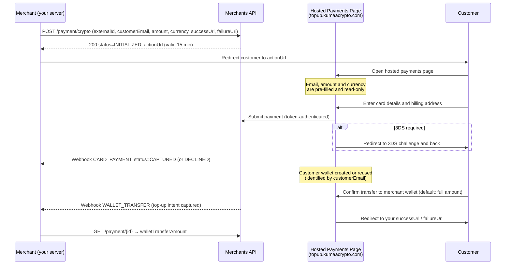
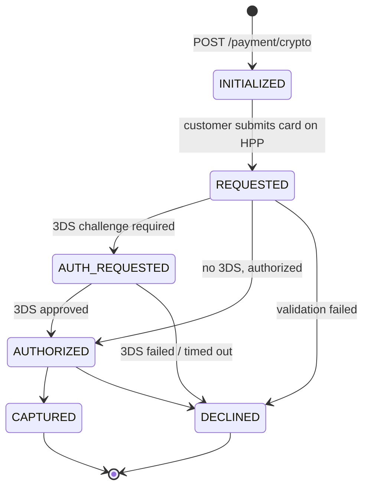

# Crypto Payments

Crypto Payments are the **new standard way to accept card payments** on the platform. Instead of collecting card data yourself and POSTing it to the API, you initiate a payment server-to-server and redirect your customer to a **Hosted Payments Page (HPP)** on the dedicated Kumaa Crypto domain (`topup.kumaacrypto.com`), where the customer completes the payment and funds your merchant crypto wallet.

Because your systems no longer collect, transmit, or store card data, your **PCI DSS exposure is significantly reduced** — cardholder data is entered exclusively on the hosted payments page and never reaches your servers.

> **Important — migration notice:** The direct one-step card payment API ([`POST /payment`](card-payments.md#create-a-payment)) is being phased out and will no longer be available to merchants. All merchants must migrate to the two-step Crypto Payment flow described on this page.

## What Changes for You

| Before (direct API)                                  | Now (Crypto Payments)                                            |
|------------------------------------------------------|------------------------------------------------------------------|
| You collect card data and send it to `POST /payment` | You never touch card data — the customer enters it on the HPP    |
| Single-step: payment only                            | Two-step: card payment, then wallet transfer to your merchant wallet |
| `successUrl` / `failureUrl` optional                 | `successUrl` / `failureUrl` required                             |
| You redirect the customer only for 3DS               | You always redirect the customer to the HPP                      |
| Card whitelisting may be required                    | Card whitelisting does not apply (disabled by default)           |
| Settlement based on the payment amount               | Settlement based on `walletTransferAmount`                       |
| `CARD_PAYMENT` webhook                               | `CARD_PAYMENT` webhook **plus** new `WALLET_TRANSFER` webhook    |

Because you no longer handle card data, card whitelisting is no longer feasible or required — the toggle now defaults to **disabled**.

## How It Works

The flow has two steps: **(a) the card payment** and **(b) the crypto transfer** from the customer's wallet to your merchant wallet.



Your server only ever talks to the Merchants API with your server-to-server (S2S) credentials. The customer's browser only ever talks to the hosted payments page, authenticated by a short-lived token embedded in the URL.

> **Warning:** Your S2S access token must **never** be shared with customers or exposed in any browser-accessible context (including the hosted page redirect). Only the `actionUrl` returned by the initiate call may be handed to the customer's browser.

## Step 1 — Initiate a Crypto Payment

Create the payment from your backend using your Bearer token (see [Authentication](authentication.md)):

```bash
curl -X POST https://sandbox-merchants-api.nonprod.paygate.systems/payment/crypto \
  -H "Authorization: Bearer YOUR_ACCESS_TOKEN" \
  -H "Content-Type: application/json" \
  -d '{
    "externalId": "order-001",
    "customerEmail": "jane@example.com",
    "currency": "EUR",
    "amount": 29.99,
    "successUrl": "https://your-shop.com/checkout/success",
    "failureUrl": "https://your-shop.com/checkout/failure"
  }'
```

### Request Fields

| Field           | Type   | Required | Description                                                                  |
|-----------------|--------|----------|------------------------------------------------------------------------------|
| `externalId`    | string | Yes      | Your unique identifier ([details](idempotency.md))                           |
| `customerEmail` | string | Yes      | Customer email — identifies the customer's crypto wallet (see [Step 3](#step-3--wallet-top-up)) |
| `currency`      | string | Yes      | ISO 4217 currency code — see [Supported Currencies](#supported-currencies)   |
| `amount`        | number | Yes      | Amount to charge (minimum `0.01`)                                            |
| `successUrl`    | string | Yes      | Where the customer is redirected after a successful payment                  |
| `failureUrl`    | string | Yes      | Where the customer is redirected after a failed payment                      |
| `metadata`      | string | No       | Free-form metadata for your own reference                                    |
| `customerIp`    | string | No       | Customer's IP address                                                        |

The `customerEmail`, `amount` and `currency` are shown to the customer on the hosted page but are **not editable** there. The customer cannot change what you charge.

The `successUrl` and `failureUrl` are not opened directly after the card payment — the platform completes the wallet top-up step first, then redirects the customer to the appropriate URL at the end of the flow.

### Supported Currencies

Each supported fiat currency is backed by a corresponding token in the crypto wallets. The currently supported currencies are:

| Code  | Currency          |
|-------|-------------------|
| `EUR` | Euro              |
| `USD` | US Dollar         |
| `GBP` | British Pound     |
| `CAD` | Canadian Dollar   |
| `AUD` | Australian Dollar |
| `NOK` | Norwegian Krone   |

Requests with any other currency code are rejected with `422 Unprocessable Entity`.

### Response

```json
{
  "id": "pay_550e8400-e29b-41d4-a716-446655440000",
  "externalId": "order-001",
  "status": "INITIALIZED",
  "actionUrl": "https://sandbox-topup.nonprod.kumaacrypto.com/cryptopublic/page/eyJhbGciOi..."
}
```

| Field        | Type   | Description                                                            |
|--------------|--------|------------------------------------------------------------------------|
| `id`         | string | Platform-generated payment ID                                          |
| `externalId` | string | Your provided identifier                                               |
| `status`     | string | Initial payment status (always `INITIALIZED`)                          |
| `actionUrl`  | string | Hosted payments page URL — redirect your customer here                 |
| `message`    | string | Decline reason, if applicable                                          |

### Status Codes

| Code | Meaning                                                     |
|------|-------------------------------------------------------------|
| 200  | Payment initialized successfully                            |
| 409  | Duplicate `externalId` (see [Idempotency](idempotency.md))  |
| 422  | Payment declined (e.g. unsupported currency)                |

### The `actionUrl`

- It points to the dedicated Kumaa Crypto payments domain (`topup.kumaacrypto.com` subdomains — e.g. `sandbox-topup.nonprod.kumaacrypto.com` in sandbox), **not** to your API domain.
- It embeds a signed token that ties the page to this specific payment and your merchant account. Treat the URL as **opaque** — do not parse, modify, or construct it yourself.
- The token is valid for **15 minutes**. If the customer does not complete the payment in time, initiate a new payment with a new `externalId`.
- The URL is single-purpose: it can only be used to complete this one payment.

## Step 2 — Redirect the Customer

Redirect the customer's browser to the `actionUrl`. On the hosted page the customer:

1. Sees the pre-filled, read-only email, amount and currency.
2. Enters the same details required for a regular card payment: card number, cardholder name, expiry, CVC, first/last name, and billing address.
3. Completes 3D Secure if the issuer requires it — the hosted page handles the redirect to the 3DS vendor and back. You do not need to do anything.

The hosted page polls the payment status and shows the outcome to the customer. Meanwhile, your server is notified via the [`CARD_PAYMENT` webhook](webhooks.md) exactly as before: the payment transitions through the familiar lifecycle and ends in `CAPTURED` or `DECLINED`.

### Payment Lifecycle



| Status           | Description                                                                   |
|------------------|-------------------------------------------------------------------------------|
| `INITIALIZED`    | Payment created via `POST /payment/crypto`, waiting for the customer on the HPP |
| `REQUESTED`      | Customer submitted card details, payment is being processed                  |
| `AUTH_REQUESTED` | Customer must complete a 3DS challenge (handled entirely by the HPP)          |
| `AUTHORIZED`     | Card authorized, funds reserved                                               |
| `CAPTURED`       | Funds captured from the card (terminal, success)                              |
| `DECLINED`       | Payment declined (terminal) — `responseCode` carries the reason, including [3DS failures](card-payments.md#3ds-failure-outcomes) |

You can fetch the payment at any time with [`GET /payment/{id}`](card-payments.md#get-payment-details) using your S2S token.

## Step 3 — Wallet Top-Up

After a successful card payment, the hosted page guides the customer through transferring crypto tokens to **your merchant wallet**. This is the AFT (account funding transaction) step:

- The `customerEmail` you provided identifies the customer's wallet.
  - **New customer:** a wallet is automatically generated, funded with the equivalent of the payment amount in the payment currency's token.
  - **Returning customer:** their existing wallet is shown, including any leftover balances from previous payments (balances are read from the public blockchain, which is the source of truth).
- The customer confirms the transfer to your merchant wallet. The **default is the full available amount** in the payment's currency (current payment plus any leftover balance in that currency); the customer may choose to transfer less. Balances in other currencies are displayed but cannot be transferred in this flow.
- Blockchain transfers are executed in grouped batches on a schedule (roughly every 10 minutes), so the on-chain top-up may complete a few minutes after the customer confirms it.

> **Note:** The wallet top-up never affects the card payment. A `CAPTURED` payment stays captured even if the blockchain transfer is delayed or fails — the platform will resolve the transfer separately.

### Merchant Wallet

Every merchant has one crypto wallet holding tokens for each fiat currency the platform supports. Wallets are created automatically during onboarding; existing merchants have had wallets provisioned for them. You can see your wallet activity and per-payment top-up amounts in the [Merchant Backoffice Portal](getting-started.md#obtaining-your-credentials).

## Webhooks

You should configure **two** webhooks (one per event type — see [Webhooks](webhooks.md)):

| Event Type        | Triggered When                                                                                  |
|-------------------|--------------------------------------------------------------------------------------------------|
| `CARD_PAYMENT`    | The card payment status changes (`REQUESTED`, `AUTHORIZED`, `CAPTURED`, `DECLINED`, …) — unchanged from the previous integration |
| `WALLET_TRANSFER` | **New.** The customer's top-up to your merchant wallet has been captured (sent at intent capture; the on-chain transfer may settle shortly after) |

Create the new webhook:

```bash
curl -X POST https://sandbox-merchants-api.nonprod.paygate.systems/webhooks \
  -H "Authorization: Bearer YOUR_ACCESS_TOKEN" \
  -H "Content-Type: application/json" \
  -d '{
    "url": "https://your-server.com/webhooks/wallet-transfers",
    "eventType": "WALLET_TRANSFER",
    "enabled": true
  }'
```

The `WALLET_TRANSFER` notification payload follows the same shape as other webhooks — `objectId` is the **payment ID** the transfer belongs to:

```json
{
  "objectId": "pay_550e8400-e29b-41d4-a716-446655440000",
  "externalId": "order-001",
  "eventType": "WALLET_TRANSFER",
  "status": "COMPLETED",
  "timestamp": "2026-06-12T10:15:00Z"
}
```

When you receive it, fetch the payment to learn the transferred amount (see below).

## Tracking the Transferred Amount

`GET /payment/{id}` now includes an optional field on every payment:

| Field                  | Type   | Description                                                                 |
|------------------------|--------|------------------------------------------------------------------------------|
| `walletTransferAmount` | number | Amount transferred to your merchant wallet for this payment (in the payment currency). Absent until a transfer has been captured. |

```bash
curl https://sandbox-merchants-api.nonprod.paygate.systems/payment/pay_550e8400-e29b-41d4-a716-446655440000 \
  -H "Authorization: Bearer YOUR_ACCESS_TOKEN"
```

> **Important — settlement:** `walletTransferAmount` may be **less than the payment amount** (the customer chooses how much to transfer) or, for returning customers with leftover balances, up to the full available amount in that currency. **Settlement is based on `walletTransferAmount`, not on the payment amount.** Reconcile against this field, and surface it in your own back office. The same value is shown per payment in the Merchant Backoffice Portal.

## Card Whitelisting

Since your systems no longer see card data, you cannot whitelist a card before a payment happens. Therefore:

- Card whitelisting **does not apply** to Crypto Payments.
- The card whitelisting requirement toggle now **defaults to disabled** for all merchants. Operations will disable it on existing production merchant accounts as part of the migration.

The [Blocklist](blocklist-and-whitelist.md) (blocking customers) is unaffected.

## Error Handling

All errors follow the standard [Problem Details format](error-handling.md). Specific to this flow:

| Situation                                  | What happens                                                                          |
|--------------------------------------------|----------------------------------------------------------------------------------------|
| `actionUrl` token expired (after 15 min)   | The hosted page rejects the customer with an authorization error. Initiate a new payment with a new `externalId`. |
| Duplicate `externalId`                     | `409 Conflict` on `POST /payment/crypto` — see [Idempotency](idempotency.md)           |
| Payment declined                           | `CARD_PAYMENT` webhook with `status=DECLINED` and a `responseCode`; the customer is redirected to your `failureUrl` |
| Customer abandons the hosted page          | The payment stays `INITIALIZED` and never completes; no funds are moved                |

## Testing

The sandbox hosted page accepts the same [test cards](card-payments.md#testing) as the direct API, including the 3DS challenge cards.

> **Warning:** Only **synthetic (fictitious) data** may be used in the sandbox environment. Real PII or cardholder data is strictly forbidden.

Suggested end-to-end test:

1. `POST /payment/crypto` with a unique `externalId` and a synthetic `customerEmail`.
2. Open the returned `actionUrl` in a browser.
3. Pay with an approved test card (e.g. `4111111111111111`, `01/2035`, `Jane Smith`) — or a 3DS card to exercise the challenge flow.
4. Confirm the wallet transfer on the page.
5. Verify you received the `CARD_PAYMENT` (`CAPTURED`) and `WALLET_TRANSFER` webhooks, and that `GET /payment/{id}` shows `walletTransferAmount`.

## Migration Checklist

1. **Replace** `POST /payment` calls with `POST /payment/crypto` — drop all `card` and `customer` fields except the customer email, and always provide `successUrl` and `failureUrl`.
2. **Remove card collection** from your checkout entirely; redirect the customer to the `actionUrl` instead (within 15 minutes of initiating).
3. **Keep** your `CARD_PAYMENT` webhook — its payloads are unchanged.
4. **Add** a `WALLET_TRANSFER` webhook and use it to trigger reconciliation.
5. **Base settlement and reconciliation on `walletTransferAmount`** from `GET /payment/{id}`, not on the payment amount.
6. **Remove card whitelisting** logic from your integration — it no longer applies.
7. Verify the full flow in sandbox using the checklist in [Testing](#testing) before going live.
