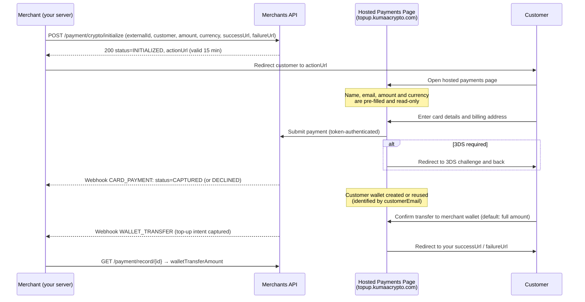
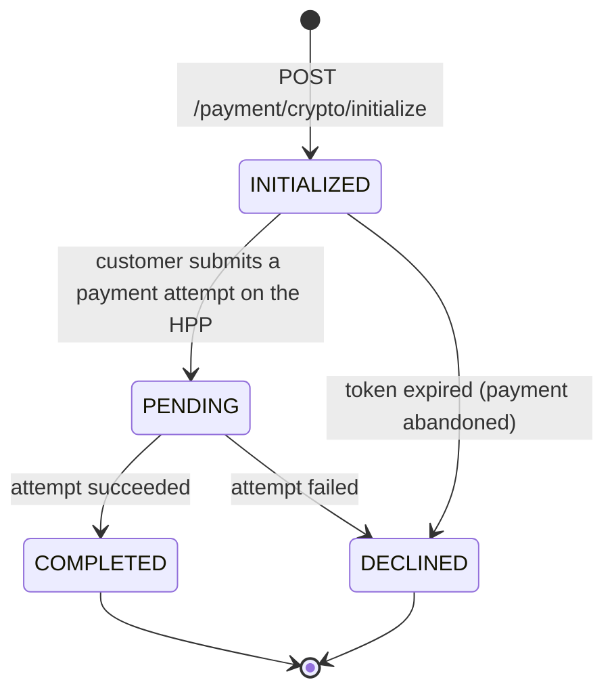

# Crypto Payments

Crypto Payments are the **standard way to accept payments** on the platform. You initialize a payment server-to-server and redirect your customer to a **Hosted Payments Page (HPP)** on the dedicated Kumaa Crypto domain (`topup.kumaacrypto.com`), where the customer completes the payment and funds your merchant crypto wallet.

Because your systems never collect, transmit, or store card data, your **PCI DSS exposure is significantly reduced** — cardholder data is entered exclusively on the hosted payments page and never reaches your servers.

> **Important — current endpoint:** The endpoint for this flow is [`POST /payment/crypto/initialize`](#step-1--initialize-a-crypto-payment). Two earlier generations are **deprecated** and must not be used for new integrations:
>
> - `POST /payment` — the direct one-step card payment API (you collected card data yourself). See [Card Payments](card-payments.md).
> - `POST /payment/crypto` — the first-generation crypto initiate endpoint. It behaves like `POST /payment/crypto/initialize` but does not require the customer name fields and returns the legacy payment shape. Migrate by switching the path, adding `customerFirstName` / `customerLastName`, and reading the payment back via [`GET /payment/record/{id}`](#payment-records-and-attempts).

## What Changes for You

| Before (direct API)                                  | Now (Crypto Payments)                                            |
|------------------------------------------------------|------------------------------------------------------------------|
| You collect card data and send it to `POST /payment` | You never touch card data — the customer enters it on the HPP    |
| One endpoint per payment method                      | One initialization; payment methods are offered on the hosted page |
| Single-step: payment only                            | Two-step: card payment, then wallet transfer to your merchant wallet |
| `successUrl` / `failureUrl` optional                 | `successUrl` / `failureUrl` required                             |
| You redirect the customer only for 3DS               | You always redirect the customer to the HPP                      |
| Settlement based on the payment amount               | Settlement based on `walletTransferAmount`                       |
| `CARD_PAYMENT` webhook                               | `CARD_PAYMENT` webhook **plus** `WALLET_TRANSFER` webhook        |
| Payment status via `GET /payment/{id}`               | Payment record with per-method attempts via `GET /payment/record/{id}` |

Card whitelisting works exactly as it does today — cards must be whitelisted before they can be used (see [Card Whitelisting](#card-whitelisting) below).

## How It Works

The flow has two steps: **(a) the card payment** and **(b) the crypto transfer** from the customer's wallet to your merchant wallet.



Your server only ever talks to the Merchants API with your server-to-server (S2S) credentials. The customer's browser only ever talks to the hosted payments page, authenticated by a short-lived token embedded in the URL.

> **Warning:** Your S2S access token must **never** be shared with customers or exposed in any browser-accessible context (including the hosted page redirect). Only the `actionUrl` returned by the initialize call may be handed to the customer's browser.

## Step 1 — Initialize a Crypto Payment

Create the payment from your backend using your Bearer token (see [Authentication](authentication.md)):

```bash
curl -X POST https://sandbox-merchants-api.nonprod.paygate.systems/payment/crypto/initialize \
  -H "Authorization: Bearer YOUR_ACCESS_TOKEN" \
  -H "Content-Type: application/json" \
  -d '{
    "externalId": "order-001",
    "customerEmail": "jane@example.com",
    "customerFirstName": "Jane",
    "customerLastName": "Doe",
    "currency": "EUR",
    "amount": 29.99,
    "successUrl": "https://your-shop.com/checkout/success",
    "failureUrl": "https://your-shop.com/checkout/failure"
  }'
```

### Request Fields

| Field               | Type   | Required | Description                                                                  |
|---------------------|--------|----------|------------------------------------------------------------------------------|
| `externalId`        | string | Yes      | Your unique identifier ([details](idempotency.md))                           |
| `customerEmail`     | string | Yes      | Customer email — identifies the customer's crypto wallet (see [Step 3](#step-3--wallet-top-up)) |
| `customerFirstName` | string | Yes      | Customer first name                                                          |
| `customerLastName`  | string | Yes      | Customer last name                                                           |
| `currency`          | string | Yes      | ISO 4217 currency code — see [Supported Currencies](#supported-currencies)   |
| `amount`            | number | Yes      | Amount to charge (minimum `0.01`, max 2 decimal places)                      |
| `successUrl`        | string | Yes      | Where the customer is redirected after a successful payment                  |
| `failureUrl`        | string | Yes      | Where the customer is redirected after a failed payment                      |
| `metadata`          | string | No       | Free-form metadata for your own reference                                    |
| `customerIp`        | string | No       | Customer's IP address                                                        |

The customer's name, email, amount and currency are shown on the hosted page but are **not editable** there. The customer cannot change what you charge.

The `successUrl` and `failureUrl` are not opened directly after the card payment — the platform completes the wallet top-up step first, then redirects the customer to the appropriate URL at the end of the flow.

### Supported Currencies

Each supported fiat currency is backed by a corresponding token in the crypto wallets. The currently supported currencies are:

| Code  | Currency          |
|-------|-------------------|
| `EUR` | Euro              |
| `USD` | US Dollar         |
| `GBP` | British Pound     |
| `CAD` | Canadian Dollar   |
| `AUD` | Australian Dollar |
| `NOK` | Norwegian Krone   |

Requests with any other currency code are rejected with `400 Bad Request`.

### Response

```json
{
  "id": "pay_550e8400-e29b-41d4-a716-446655440000",
  "externalId": "order-001",
  "status": "INITIALIZED",
  "actionUrl": "https://sandbox-topup.nonprod.kumaacrypto.com/cryptopublic/payments/page/eyJhbGciOi..."
}
```

| Field        | Type   | Description                                                            |
|--------------|--------|------------------------------------------------------------------------|
| `id`         | string | Platform-generated payment ID                                          |
| `externalId` | string | Your provided identifier                                               |
| `status`     | string | Initial payment status (always `INITIALIZED`)                          |
| `actionUrl`  | string | Hosted payments page URL — redirect your customer here                 |

### Status Codes

| Code | Meaning                                                     |
|------|-------------------------------------------------------------|
| 200  | Payment initialized successfully                            |
| 400  | Invalid request (e.g. unsupported currency, malformed field) |
| 409  | Duplicate `externalId` (see [Idempotency](idempotency.md))  |
| 422  | Payment cannot be accepted (e.g. merchant account not active) |

### The `actionUrl`

- It points to the dedicated Kumaa Crypto payments domain (`topup.kumaacrypto.com` subdomains — e.g. `sandbox-topup.nonprod.kumaacrypto.com` in sandbox), **not** to your API domain.
- It embeds a signed token that ties the page to this specific payment and your merchant account. Treat the URL as **opaque** — do not parse, modify, or construct it yourself.
- The token is valid for **15 minutes**. Shortly after it expires, a payment that is still `INITIALIZED` is automatically **declined** (see [Payment Lifecycle](#payment-lifecycle)). If the customer did not complete the payment in time, initialize a new payment with a new `externalId`.
- The URL is single-purpose: it can only be used to complete this one payment.

## Step 2 — Redirect the Customer

Redirect the customer's browser to the `actionUrl`. On the hosted page the customer:

1. Sees the pre-filled, read-only name, email, amount and currency.
2. Enters the same details required for a regular card payment: card number, cardholder name, expiry, CVC, and billing address.
3. Completes 3D Secure if the issuer requires it — the hosted page handles the redirect to the 3DS vendor and back. You do not need to do anything.

The hosted page polls the payment status and shows the outcome to the customer. Meanwhile, your server is notified via the [`CARD_PAYMENT` webhook](webhooks.md): the card attempt transitions through the familiar card lifecycle and ends in `CAPTURED` or `DECLINED`.

### Payment Lifecycle

A crypto payment is a **payment record** with its own top-level lifecycle. Each payment method the customer attempts on the hosted page (currently card) is recorded as an **attempt** with its own method-specific sub-lifecycle.



| Status        | Description                                                                   |
|---------------|-------------------------------------------------------------------------------|
| `INITIALIZED` | Payment created via `POST /payment/crypto/initialize`, waiting for the customer on the HPP. If the customer never submits the payment, it is automatically declined shortly after the 15-minute token expires — the `CARD_PAYMENT` webhook reports `status: DECLINED` with `responseCode: INITIALIZED_PAYMENT_EXPIRED` |
| `PENDING`     | The customer submitted a payment attempt which is being processed             |
| `COMPLETED`   | A payment attempt succeeded (terminal, success)                               |
| `DECLINED`    | The payment failed (terminal) — `responseCode` carries the reason, including [3DS failures](card-payments.md#3ds-failure-outcomes) |

A **card attempt** inside the record moves through the card sub-lifecycle you may know from the direct API: `REQUESTED → AUTH_REQUESTED (3DS) → AUTHORIZED → CAPTURED`, or `DECLINED` at any of those steps. The attempt-level status and `responseCode` are visible in the `attempts` array of the payment record (see below).

## Payment Records and Attempts

You can fetch the payment at any time with `GET /payment/record/{id}` using your S2S token:

```bash
curl https://sandbox-merchants-api.nonprod.paygate.systems/payment/record/pay_550e8400-e29b-41d4-a716-446655440000 \
  -H "Authorization: Bearer YOUR_ACCESS_TOKEN"
```

The response contains the top-level record (status, amounts, redirect URLs, wallet-transfer fields) plus an `attempts` array — one entry per payment method attempt the customer made, **oldest first**:

```json
{
  "id": "pay_550e8400-e29b-41d4-a716-446655440000",
  "type": "CHECKOUT",
  "externalId": "order-001",
  "status": "COMPLETED",
  "customerEmail": "jane@example.com",
  "customerFirstName": "Jane",
  "customerLastName": "Doe",
  "currency": "EUR",
  "amount": 29.99,
  "successUrl": "https://your-shop.com/checkout/success",
  "failureUrl": "https://your-shop.com/checkout/failure",
  "actionUrl": "https://sandbox-topup.nonprod.kumaacrypto.com/cryptopublic/payments/page/eyJhbGciOi...",
  "attempts": [
    {
      "method": "CARD",
      "card": {
        "id": "crd_7c9e6679-7425-40de-944b-e07fc1f90ae7",
        "status": "CAPTURED",
        "amount": 29.99,
        "currency": "EUR",
        "card": { "binCode": "411111", "last4": "1111", "issuer": "VISA" },
        "createdAt": "2026-08-17T10:05:00Z",
        "updatedAt": "2026-08-17T10:06:10Z"
      }
    }
  ],
  "walletTransferAmount": 29.99,
  "walletTransferCurrency": "EUR",
  "walletTransferStatus": "COMPLETED",
  "createdAt": "2026-08-17T10:04:00Z",
  "updatedAt": "2026-08-17T10:07:00Z",
  "finishedAt": "2026-08-17T10:06:10Z"
}
```

Each attempt carries a `method` (`CARD` or `BANK_TRANSFER`) and the matching sub-object (`card` or `bankTransfer`) with the attempt's own ID, status, `responseCode`, and timestamps. This is how the platform supports offering several payment methods for a single initialized payment: a failed attempt with one method can be followed by another attempt, and every attempt stays visible in the record.

`GET /payment/record` lists your payment records with the same pagination and `externalId` filtering as the other list endpoints.

## Step 3 — Wallet Top-Up

After a successful card payment, the hosted page guides the customer through transferring crypto tokens to **your merchant wallet**. This is the AFT (account funding transaction) step:

- The `customerEmail` you provided identifies the customer's wallet.
  - **New customer:** a wallet is automatically generated, funded with the equivalent of the payment amount in the payment currency's token.
  - **Returning customer:** their existing wallet is shown, including any leftover balances from previous payments (balances are read from the public blockchain, which is the source of truth).
- The customer confirms the transfer to your merchant wallet. The **default is the full available amount** in the payment's currency (current payment plus any leftover balance in that currency); the customer may choose to transfer less. Balances in other currencies are displayed but cannot be transferred in this flow.
- Blockchain transfers are executed in grouped batches on a schedule (every 15 minutes), so the on-chain top-up may complete several minutes after the customer confirms it.

> **Note:** The wallet top-up never affects the card payment. A captured payment stays captured even if the blockchain transfer is delayed or fails — the platform will resolve the transfer separately.

> **Note:** If the customer never confirms the transfer, the top-up step expires shortly after the 15-minute session token runs out. The card payment stays captured, and a `WALLET_TRANSFER` webhook with `status: EXPIRED` is sent (see [Webhooks](#webhooks) below).

### Merchant Wallet

Every merchant has one crypto wallet holding tokens for each fiat currency the platform supports. Wallets are created automatically during onboarding; existing merchants have had wallets provisioned for them. You can see your wallet activity and per-payment top-up amounts in the [Merchant Backoffice Portal](getting-started.md#obtaining-your-credentials).

## Webhooks

You should configure **two** webhooks (one per event type — see [Webhooks](webhooks.md)):

| Event Type        | Triggered When                                                                                  |
|-------------------|--------------------------------------------------------------------------------------------------|
| `CARD_PAYMENT`    | The card payment status changes (`AUTH_REQUESTED`, `CAPTURED`, `DECLINED`, …) — unchanged from the previous integration |
| `WALLET_TRANSFER` | The customer's top-up to your merchant wallet has been captured (`status: COMPLETED`, sent at intent capture; the on-chain transfer may settle shortly after), **or** the top-up window expired without the customer confirming a transfer (`status: EXPIRED`) |

Create the new webhook:

```bash
curl -X POST https://sandbox-merchants-api.nonprod.paygate.systems/webhooks \
  -H "Authorization: Bearer YOUR_ACCESS_TOKEN" \
  -H "Content-Type: application/json" \
  -d '{
    "url": "https://your-server.com/webhooks/wallet-transfers",
    "eventType": "WALLET_TRANSFER",
    "enabled": true
  }'
```

The `WALLET_TRANSFER` notification payload follows the same shape as other webhooks — `objectId` is the **payment ID** the transfer belongs to:

```json
{
  "objectId": "pay_550e8400-e29b-41d4-a716-446655440000",
  "externalId": "order-001",
  "eventType": "WALLET_TRANSFER",
  "status": "COMPLETED",
  "timestamp": "2026-06-12T10:15:00Z"
}
```

The `status` field is `COMPLETED` when the top-up intent was captured, or `EXPIRED` when the customer completed the card payment but never confirmed a transfer before the session expired. When you receive a `COMPLETED` notification, fetch the payment record to learn the transferred amount (see below).

## Tracking the Transferred Amount

`GET /payment/record/{id}` includes optional wallet-transfer fields on every payment record:

| Field                     | Type   | Description                                                                 |
|---------------------------|--------|------------------------------------------------------------------------------|
| `walletTransferAmount`    | number | Amount transferred to your merchant wallet for this payment. Absent until a transfer has been captured. |
| `walletTransferCurrency`  | string | Currency of the wallet transfer amount.                                     |
| `walletTransferStatus`    | string | `COMPLETED` — the top-up was captured; `EXPIRED` — the customer never confirmed a transfer. Absent while the transfer is still possible. |
| `walletTransferTxHashUrl` | string | Link to the on-chain transaction for the customer-to-merchant transfer. Absent until the blockchain transfer has been executed. |

> **Important — settlement:** `walletTransferAmount` may be **less than the payment amount** (the customer chooses how much to transfer) or, for returning customers with leftover balances, up to the full available amount in that currency. **Settlement is based on `walletTransferAmount`, not on the payment amount.** Reconcile against this field, and surface it in your own back office. The same value is shown per payment in the Merchant Backoffice Portal.

## Card Whitelisting

Card whitelisting is **mandatory**: each card must be registered via the [whitelist API](blocklist-and-whitelist.md#card-whitelist) and clear the ~72-hour cooldown period **before** it can be used to pay. (Platform administration can exempt individual merchant accounts from this requirement — see [Blocklist and Whitelist](blocklist-and-whitelist.md#card-whitelist).)

Because the customer enters their card on the hosted payments page rather than through your systems, you must whitelist the card ahead of time (server-to-server, using your S2S token) so that the card the customer submits on the HPP is already approved. A payment attempted on the HPP with a non-whitelisted or cooldown-active card is **declined** — the `CARD_PAYMENT` webhook reports `status=DECLINED` and the customer is redirected to your `failureUrl`.

The [Blocklist](blocklist-and-whitelist.md) (blocking customers) is unaffected.

## Error Handling

All errors follow the standard [error format](error-handling.md). Specific to this flow:

| Situation                                  | What happens                                                                          |
|--------------------------------------------|----------------------------------------------------------------------------------------|
| `actionUrl` token expired (after 15 min)   | The hosted page redirects the customer to a session-expired page. Initialize a new payment with a new `externalId`. |
| Duplicate `externalId`                     | `409 Conflict` on `POST /payment/crypto/initialize` — see [Idempotency](idempotency.md) |
| Payment declined                           | `CARD_PAYMENT` webhook with `status=DECLINED` and a `responseCode`; the customer is redirected to your `failureUrl` |
| Customer abandons the hosted page          | Shortly after the token expires, the payment is declined automatically — `CARD_PAYMENT` webhook with `status=DECLINED` and `responseCode=INITIALIZED_PAYMENT_EXPIRED`; no funds are moved |
| Customer opens the page from a restricted location | The customer is redirected to a blocked-location page and the payment is declined — `CARD_PAYMENT` webhook with `status=DECLINED` and a `BLOCKED_LOCATION*` `responseCode` |
| Customer pays but never confirms the wallet top-up | The card payment stays captured; a `WALLET_TRANSFER` webhook with `status=EXPIRED` is sent after the session expires |

## Testing

The sandbox hosted page accepts the same [test cards](card-payments.md#testing) as the direct API, including the 3DS challenge cards.

> **Warning:** Only **synthetic (fictitious) data** may be used in the sandbox environment. Real PII or cardholder data is strictly forbidden.

Suggested end-to-end test:

1. `POST /payment/crypto/initialize` with a unique `externalId` and a synthetic customer name and `customerEmail`.
2. Open the returned `actionUrl` in a browser.
3. Pay with an approved test card (e.g. `4111111111111111`, `01/2035`, `Jane Smith`) — or a 3DS card to exercise the challenge flow.
4. Confirm the wallet transfer on the page.
5. Verify you received the `CARD_PAYMENT` (`CAPTURED`) and `WALLET_TRANSFER` webhooks, and that `GET /payment/record/{id}` shows `walletTransferAmount`.

## Migration Checklist

1. **Replace** `POST /payment` (or first-generation `POST /payment/crypto`) calls with `POST /payment/crypto/initialize` — drop all `card` fields, provide `customerEmail`, `customerFirstName` and `customerLastName`, and always provide `successUrl` and `failureUrl`.
2. **Remove card collection** from your checkout entirely; redirect the customer to the `actionUrl` instead (within 15 minutes of initializing).
3. **Keep** your `CARD_PAYMENT` webhook — its payloads are unchanged.
4. **Add** a `WALLET_TRANSFER` webhook and use it to trigger reconciliation.
5. **Switch reads** to `GET /payment/record/{id}` / `GET /payment/record` for payments created via the initialize endpoint.
6. **Base settlement and reconciliation on `walletTransferAmount`**, not on the payment amount.
7. **Keep your card whitelisting** integration — cards must still be whitelisted (and clear the cooldown) before the customer pays on the HPP. See [Card Whitelisting](#card-whitelisting).
8. Verify the full flow in sandbox using the checklist in [Testing](#testing) before going live.
