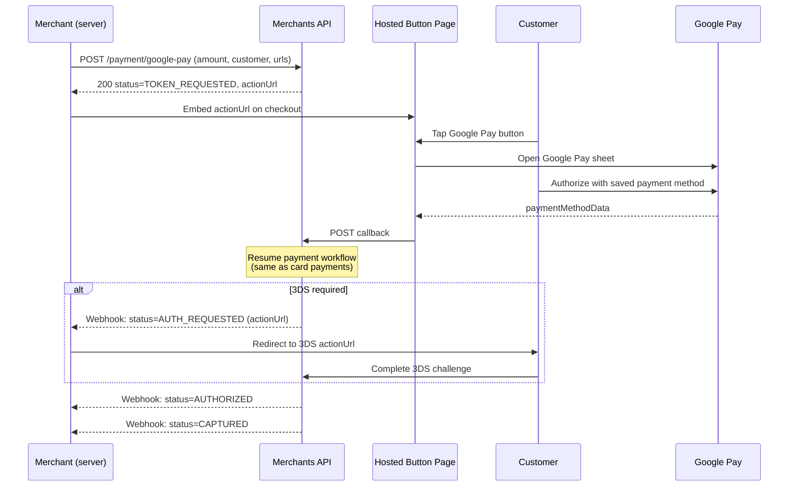
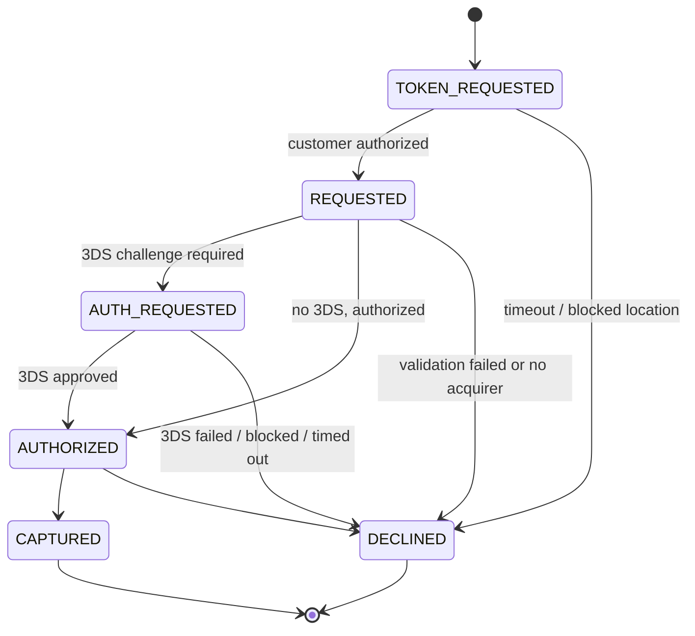

# Google Pay

Accept payments through Google Pay without ever handling card data yourself. You initiate the payment server-side and we return a hosted button page, which you then embed on your checkout. A customer with a valid payment method in their Google Wallet taps the Google Pay button, completes the sheet, and the platform takes over — the rest follows the standard card-payment workflow, including 3D Secure when required.

## Integration Flow



From the moment the callback is received, a Google Pay payment behaves exactly like a regular [card payment](card-payments.md) — same lifecycle, same webhooks, same 3DS handling. The only Google Pay–specific stages are the `TOKEN_REQUESTED` window during which the customer interacts with the hosted button page, and the decline `responseCode`s for window expiry and blocked locations.

## Create a Google Pay Payment

```bash
curl -X POST https://sandbox-merchants-api.nonprod.paygate.systems/payment/google-pay \
  -H "Authorization: Bearer YOUR_ACCESS_TOKEN" \
  -H "Content-Type: application/json" \
  -d '{
    "externalId": "gp-order-001",
    "currency": "EUR",
    "amount": 29.99,
    "customer": {
      "email": "jane@example.com",
      "firstName": "Jane",
      "lastName": "Doe",
      "billingAddress": {
        "address1": "123 Main St",
        "city": "Berlin",
        "country": "DEU",
        "state": "BE",
        "zip": "10115"
      }
    },
    "successUrl": "https://your-site.com/payment/success",
    "failureUrl": "https://your-site.com/payment/failure"
  }'
```

Notice the request body has **no `card` object** — that's the whole point. Card data never touches your server. Everything else (customer, billing address, currency, amount, `externalId`, redirect URLs, metadata) follows the same shape as a regular [card payment](card-payments.md#create-a-payment). See the API reference for the full field list.

### Response

```json
{
  "id": "pay_abc123",
  "externalId": "gp-order-001",
  "status": "TOKEN_REQUESTED",
  "actionUrl": "https://sandbox-merchants-api.nonprod.paygate.systems/public/payments/google-pay/button/eyJhbGciOi..."
}
```

| Field        | Type   | Description                                                                |
|--------------|--------|----------------------------------------------------------------------------|
| `id`         | string | Platform-generated payment ID                                              |
| `externalId` | string | Your provided identifier                                                   |
| `status`     | string | Initial payment status (always `TOKEN_REQUESTED`)                          |
| `actionUrl`  | string | URL of the hosted Google Pay button page — render this on your checkout    |

## Rendering the Button

The `actionUrl` returned by the create call points to a self-contained, statically rendered page that:

1. Loads the Google Pay JS library
2. Renders the official Google Pay button
3. Opens the Google Pay payment sheet when the customer taps it
4. Hands the customer's authorization back to the platform, which then resumes the payment

**Embed it as an iframe on your checkout page:**

```html
<iframe
  src="https://sandbox-merchants-api.nonprod.paygate.systems/public/payments/google-pay/button/eyJhbGciOi..."
  title="Google Pay"
  style="border: 0; width: 240px; height: 48px;"
  allow="payment">
</iframe>
```

You do **not** need to include the Google Pay JS SDK, set up a merchant ID with Google, or implement the `onPaymentAuthorized` handler — the hosted page does all of that. You only need to render the iframe and wait for webhook updates on the payment.

> **Note:** The `actionUrl` is single-use and bound to the payment ID. It expires when the payment leaves the `TOKEN_REQUESTED` state (after the customer pays, after the timeout window, or once we determine the customer's location is unsupported).

## Payment Lifecycle

A Google Pay payment starts in `TOKEN_REQUESTED` and transitions into the regular card-payment lifecycle as soon as the customer authorizes on the Google Pay sheet.



| Status            | Description                                                                                |
|-------------------|--------------------------------------------------------------------------------------------|
| `TOKEN_REQUESTED` | Hosted button page is live; the platform is waiting for the customer to authorize Google Pay |
| `REQUESTED`       | Customer authorized; standard card-payment processing has begun                            |
| `AUTH_REQUESTED`  | Customer must complete a 3DS challenge (see [3D Secure](card-payments.md#3d-secure-3ds))    |
| `AUTHORIZED`      | Card authorized, funds reserved                                                            |
| `CAPTURED`        | Funds captured (terminal, success)                                                         |
| `DECLINED`        | Payment declined (terminal) — inspect `responseCode` for the reason                        |

### Google Pay–specific decline reasons

When a payment is declined while still in `TOKEN_REQUESTED`, the `responseCode` field tells you why:

| `responseCode`        | When it is set                                                                  |
|-----------------------|---------------------------------------------------------------------------------|
| `GOOGLE_PAY_EXPIRED`  | The customer did not complete the Google Pay sheet within the allowed window.   |
| `RESTRICTED_COUNTRY`  | The customer's detected location is not supported for Google Pay.               |
| `INTERNAL_ERROR`      | The platform could not recover a usable payment method from the Google Pay sheet. |

In all three cases, the payment transitions directly from `TOKEN_REQUESTED` to `DECLINED`, a `CARD_PAYMENT` webhook is fired, and no card-side processing happens. The customer can retry by creating a new payment.

Declines that occur **after** the customer has authorized (validation failures, 3DS failures, issuer declines, etc.) follow exactly the same conventions as regular [card payments](card-payments.md#payment-lifecycle).

## Webhooks

Google Pay payments emit the standard `CARD_PAYMENT` webhook events. There is no separate event type. See [Webhooks](webhooks.md) for setup instructions.

You will receive webhooks at every status transition — `TOKEN_REQUESTED → REQUESTED`, optional `AUTH_REQUESTED`, `AUTHORIZED`, `CAPTURED`, or `DECLINED`. As with card payments, the `actionUrl` for the 3DS challenge (when applicable) is delivered on the `AUTH_REQUESTED` webhook, never on the create response.

## Get Payment Details

```bash
curl https://sandbox-merchants-api.nonprod.paygate.systems/payment/pay_abc123 \
  -H "Authorization: Bearer YOUR_ACCESS_TOKEN"
```

Google Pay payments are returned by the same [`GET /payment/{id}`](card-payments.md#get-payment-details) endpoint as card payments. Once the customer authorizes, the response includes the masked card details (`binCode`, `last4`, `issuer`) of the underlying payment method that Google Pay returned.

## Testing

To test Google Pay in the **sandbox** environment:

1. Use a Google account that is enrolled in the [Google Pay TEST environment](https://developers.google.com/pay/api/web/guides/test-and-deploy/integration-checklist) and has a test card saved in its Google Wallet.
2. Open the `actionUrl` iframe in a Chrome browser on a device that supports Google Pay.
3. Tap the Google Pay button and complete the sheet.
4. Observe the payment transition through `TOKEN_REQUESTED → REQUESTED → ... → CAPTURED` via webhook or by polling `GET /payment/{id}`.

> **Warning:** Only **synthetic (fictitious) data** may be used in the sandbox environment. The use of real personally identifiable information (PII) or real cardholder data (CHD) is **strictly forbidden**.

### Simulating decline outcomes

| To simulate…                  | Do this                                                                                  |
|-------------------------------|------------------------------------------------------------------------------------------|
| `GOOGLE_PAY_EXPIRED`          | Create a payment and do not interact with the button page; wait for the window to elapse |
| `RESTRICTED_COUNTRY`          | Open the `actionUrl` from an IP in an unsupported region (the page redirects to the blocked-location page automatically) |
| 3DS challenge / failure / issuer declines | Use one of the test cards listed in [Card Payments → Testing](card-payments.md#testing) as the payment method saved in your Google Wallet |
