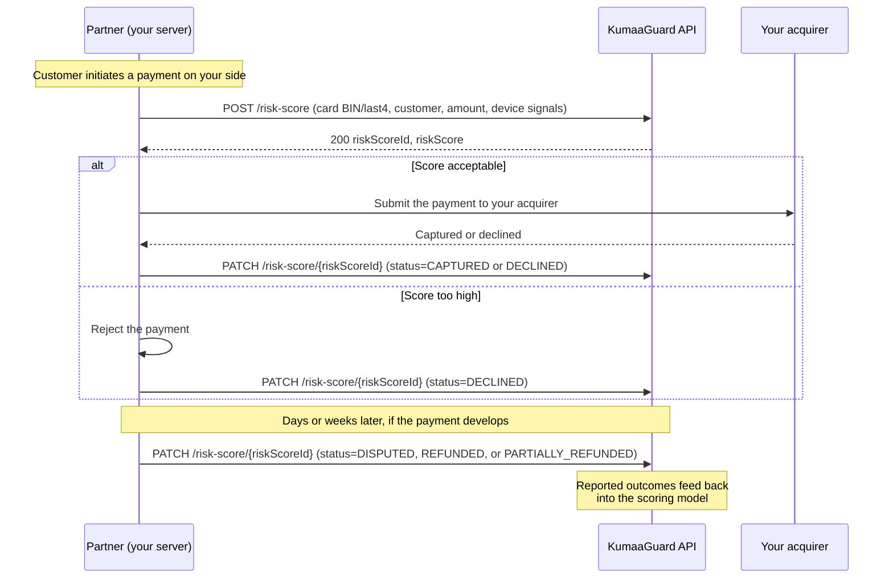
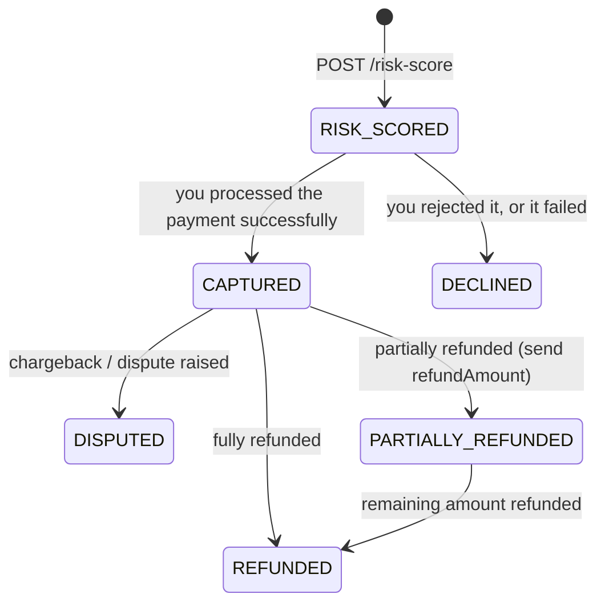

# KumaaGuard

KumaaGuard is the platform's payment risk-rating service for **partners** — built to guard merchants against **friendly fraud**: a customer buys real goods, then forges "proof" to demand a refund or files a chargeback, and the bank sides with them. The merchant loses the goods, the money, and the dispute fee.

KumaaGuard puts an ML-driven risk check in front of that. Before you submit a payment to your acquirer, you send its details to KumaaGuard and receive a fraud risk score in the same response. You decide whether to proceed, then report what actually happened — captured, declined, and later disputed or refunded if the payment develops. Every reported outcome feeds back into the model, so scoring accuracy improves with use.

> **Note:** This API is for **KumaaGuard partners**, a separate role from merchants. Partner accounts are onboarded by the platform; upon successful onboarding you receive your API credentials by email.

## Base URLs

| Environment | API                                          | Auth                                          |
|-------------|----------------------------------------------|-----------------------------------------------|
| Sandbox     | `https://sandbox-api.nonprod.kumaaguard.com` | `https://sandbox-auth.nonprod.kumaaguard.com` |
| Production  | `https://api.prod.kumaaguard.com`            | `https://auth.prod.kumaaguard.com`            |

Start in **sandbox**: once your partner account is onboarded there, use the sandbox credentials from your onboarding email to exercise every endpoint on this page against the sandbox API before going live.

> **Warning — Sandbox Data Policy:** as everywhere on the platform, the sandbox is strictly for **synthetic (fictitious) data**. Never send real PII or real card identifiers (even BIN + last4 combinations of real cards) when testing.

## What You Send — and What You Don't

Risk rating works on payment *metadata*. You never send the full card number or CVC:

| You send                                     | You never send        |
|----------------------------------------------|-----------------------|
| Card BIN (first 6–8 digits) and last 4 digits | Full card number (PAN) |
| Cardholder name and expiry                   | CVC / CVV             |
| Customer identity and billing address        |                       |
| Amount, currency, payment timestamp          |                       |
| Optional device signals (IP, user agent, device fingerprint, VPN/proxy flag) |  |

This keeps your KumaaGuard integration out of cardholder-data scope: the request cannot carry sensitive authentication data by construction.

## Workflow



The flow is synchronous: the risk score is returned directly in the `POST /risk-score` response, before you submit the payment to the acquirer you have integrated — there are no webhooks or polling. The outcome reports (`PATCH`) close the loop, and they are not one-shot: a payment you reported `CAPTURED` today can be updated to `DISPUTED` a week later when the chargeback arrives. Accurate and timely outcome reporting directly improves the quality of the scores you receive.

## Authentication

KumaaGuard partners use the same OAuth2 client-credentials flow as described in [Authentication](authentication.md), with credentials issued during partner onboarding. Exchange your `client_id` / `client_secret` for a Bearer token on the KumaaGuard auth host for your environment, then send the token in the `Authorization` header of every request:

```bash
curl -X POST https://sandbox-auth.nonprod.kumaaguard.com/oauth2/token \
  -H "Content-Type: application/x-www-form-urlencoded" \
  -d "client_id=YOUR_CLIENT_ID" \
  -d "client_secret=YOUR_CLIENT_SECRET" \
  -d "grant_type=client_credentials"
```

Token lifecycle, caching, and refresh strategy are identical to the merchant API — see [Authentication](authentication.md).

## Request a Risk Score

```bash
curl -X POST https://api.prod.kumaaguard.com/risk-score \
  -H "Authorization: Bearer YOUR_ACCESS_TOKEN" \
  -H "Content-Type: application/json" \
  -d '{
    "externalId": "txn-48291",
    "card": {
      "bin": "424242",
      "last4": "4242",
      "name": "Jane Doe",
      "expiry": { "month": 12, "year": 2027 }
    },
    "customer": {
      "email": "jane@example.com",
      "firstName": "Jane",
      "lastName": "Doe",
      "billingAddress": {
        "address1": "123 Main St",
        "city": "Berlin",
        "country": "DEU",
        "state": "BE",
        "zip": "10115"
      }
    },
    "currency": "EUR",
    "amount": 129.99,
    "paymentDateTime": "2026-08-17T14:30:00+02:00",
    "ipAddress": "203.0.113.10",
    "isVpnOrProxy": false,
    "userAgent": "Mozilla/5.0 (iPhone; CPU iPhone OS 17_0 like Mac OS X) AppleWebKit/605.1.15",
    "deviceFingerprint": "a1b2c3d4e5f6"
  }'
```

### Request Fields

| Field               | Type    | Required | Description                                                     |
|---------------------|---------|----------|------------------------------------------------------------------|
| `externalId`        | string  | Yes      | Your unique identifier for this payment (`^[a-zA-Z0-9_-]+$`, max 255). Duplicate submissions return `409 Conflict` — see [Idempotency](idempotency.md). |
| `card.bin`          | string  | Yes      | Card BIN (6–8 digits)                                            |
| `card.last4`        | string  | Yes      | Last 4 digits of the card number                                 |
| `card.name`         | string  | Yes      | Cardholder name                                                  |
| `card.expiry`       | object  | Yes      | Card expiry (`month` 1–12, `year` 4-digit)                       |
| `customer`          | object  | Yes      | Customer identity: `email`, `firstName`, `lastName`, `billingAddress`, optional `phone` — same shape as elsewhere in the API |
| `currency`          | string  | Yes      | ISO 4217 currency code                                           |
| `amount`            | number  | Yes      | Payment amount (minimum `0.01`, max 2 decimal places)            |
| `paymentDateTime`   | string  | Yes      | When the payment was initiated — ISO 8601 with timezone          |
| `ipAddress`         | string  | No       | Customer IP address                                              |
| `isVpnOrProxy`      | boolean | No       | Whether the customer IP is a known VPN or proxy                  |
| `userAgent`         | string  | No       | Customer browser user-agent string                               |
| `deviceFingerprint` | string  | No       | Device fingerprint hash from your device-intelligence provider   |

> **Tip:** the optional device signals (`ipAddress`, `isVpnOrProxy`, `userAgent`, `deviceFingerprint`) measurably improve scoring accuracy — send them whenever you have them.

### Response

```json
{
  "riskScoreId": "rsc_01234567-0000-0000-0000-000000000000",
  "riskScore": 45.56
}
```

| Field         | Type   | Description                                                        |
|---------------|--------|--------------------------------------------------------------------|
| `riskScoreId` | string | Platform-generated risk score ID — use it to report the outcome    |
| `riskScore`   | number | Fraud risk score from `0.00` (lowest risk) to `100.00` (highest risk), with two decimal places of precision |

How you act on the score is your decision — analyze the risk ratings you receive against your own traffic and adjust your thresholds to match your expectations and risk appetite.

### Status Codes

| Code | Meaning                                                     |
|------|-------------------------------------------------------------|
| 200  | Risk score computed                                         |
| 409  | Duplicate `externalId` (see [Idempotency](idempotency.md))  |

## Report the Payment Outcome

After you process (or reject) the payment, report what actually happened. Update the same record again later if the payment develops — a chargeback dispute, a refund.

```bash
curl -X PATCH https://api.prod.kumaaguard.com/risk-score/rsc_01234567-0000-0000-0000-000000000000 \
  -H "Authorization: Bearer YOUR_ACCESS_TOKEN" \
  -H "Content-Type: application/json" \
  -d '{
    "status": "CAPTURED"
  }'
```

### Request Fields

| Field          | Type   | Required | Description                                                     |
|----------------|--------|----------|------------------------------------------------------------------|
| `status`       | string | Yes      | The payment outcome — see [Outcome Statuses](#outcome-statuses)  |
| `refundAmount` | number | *        | Required when `status` is `PARTIALLY_REFUNDED`; the amount refunded |

### Outcome Statuses

A risk-scored payment starts as `RISK_SCORED` and is updated by you as the payment progresses:



| Status               | Reported when                                                       |
|----------------------|---------------------------------------------------------------------|
| `RISK_SCORED`        | Initial state — set automatically when the score is created         |
| `CAPTURED`           | The payment was successfully captured                               |
| `DECLINED`           | The payment was declined or you rejected it based on the score      |
| `DISPUTED`           | The customer disputed the payment (chargeback)                      |
| `REFUNDED`           | The payment was fully refunded                                      |
| `PARTIALLY_REFUNDED` | The payment was partially refunded — include `refundAmount`         |

### Response

```json
{
  "riskScoreId": "rsc_01234567-0000-0000-0000-000000000000"
}
```

## Get a Risk Score

```bash
curl https://api.prod.kumaaguard.com/risk-score/rsc_01234567-0000-0000-0000-000000000000 \
  -H "Authorization: Bearer YOUR_ACCESS_TOKEN"
```

### Response

```json
{
  "riskScoreId": "rsc_01234567-0000-0000-0000-000000000000",
  "riskScore": 45.56,
  "externalId": "txn-48291",
  "status": "CAPTURED",
  "createdAt": "2026-08-17T14:30:05Z",
  "updatedAt": "2026-08-17T14:31:10Z"
}
```

## List Risk Scores

```bash
curl "https://api.prod.kumaaguard.com/risk-score?status=CAPTURED&limit=20&order=desc" \
  -H "Authorization: Bearer YOUR_ACCESS_TOKEN"
```

### Query Parameters

| Parameter | Type    | Default | Description                                      |
|-----------|---------|---------|--------------------------------------------------|
| `status`  | string  | —       | Filter by outcome status (repeatable)            |
| `cursor`  | string  | —       | Cursor for the next page of results              |
| `limit`   | integer | 20      | Number of results per page (1–100)               |
| `order`   | string  | —       | Sort order: `asc` or `desc`                      |

The response contains `items` (each in the same shape as [Get a Risk Score](#get-a-risk-score)) and a `nextCursor` for pagination.

## Best Practices

- **Score before you authorize.** Request the score at the decision point, before submitting the payment to your processor — that is what the model is calibrated for.
- **Always close the loop.** Report `CAPTURED` / `DECLINED` promptly, and keep the record updated on disputes and refunds. Outcome data is what trains the model — partners who report accurately get better scores.
- **Use a unique `externalId` per payment** so retries after network failures are safe (`409 Conflict` on replay).
- **Send device signals when available.** IP, user agent, VPN/proxy flag, and device fingerprint materially help fraud detection.
