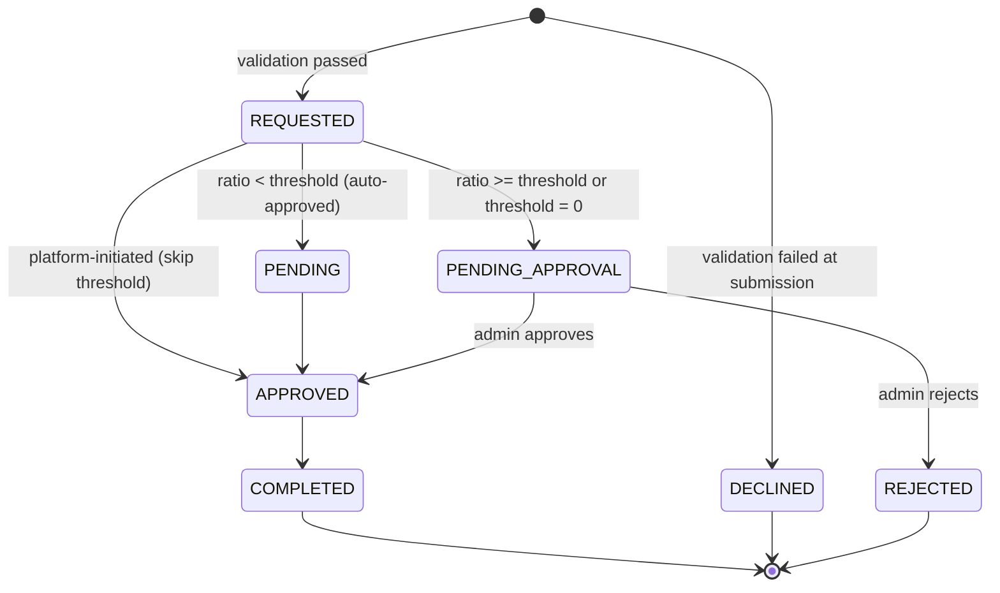

# Refunds

You can refund a completed card payment either fully or partially. Refunds are processed against the original payment using its platform-generated `id`.

## Create a Refund

```bash
curl -X POST https://sandbox-merchants-api.nonprod.paygate.systems/payment/pay_abc123/refund \
  -H "Authorization: Bearer YOUR_ACCESS_TOKEN" \
  -H "Content-Type: application/json" \
  -d '{
    "externalId": "refund-order-001",
    "amount": 10.00
  }'
```

### Request Fields

| Field        | Type   | Required | Description                                              |
|--------------|--------|----------|----------------------------------------------------------|
| `externalId` | string | Yes      | Your unique identifier for this refund ([details](idempotency.md)) |
| `amount`     | number | No       | Amount to refund (minimum `0.01`). Omit for a full refund. |

### Full vs. Partial Refund

- **Full refund** — omit the `amount` field. The entire payment amount is refunded.
- **Partial refund** — provide an `amount` less than or equal to the original payment amount.

> **Note:** Partial refunds are not always available. Depending on the payment processing path, some payments only support full refunds. If you request a partial refund on a payment that does not support it, the API returns an error. When this happens, you can request a full refund instead.

### Response

**200 OK** — refund processed immediately:

```json
{
  "id": "ref_def456",
  "paymentId": "pay_abc123",
  "amount": 10.00,
  "createdAt": "2026-03-04T12:00:00Z",
  "status": "COMPLETED"
}
```

**201 Created** — refund submitted for processing:

```json
{
  "id": "ref_def456",
  "paymentId": "pay_abc123",
  "amount": 10.00,
  "createdAt": "2026-03-04T12:00:00Z",
  "status": "REQUESTED"
}
```

### Response Fields

| Field       | Type   | Description                              |
|-------------|--------|------------------------------------------|
| `id`        | string | Platform-generated refund ID             |
| `paymentId` | string | ID of the original payment               |
| `amount`    | number | Refund amount                            |
| `createdAt` | string | Timestamp of refund creation (ISO 8601)  |
| `status`    | string | Refund status                            |

### Status Codes

| Code | Meaning                                             |
|------|-----------------------------------------------------|
| 200  | Refund processed successfully                       |
| 201  | Refund submitted for processing                     |
| 422  | Refund cannot be processed (e.g. exceeds payment amount) |

## Checking Refund Status

Refunds are returned as part of the payment details. Use the refund `id` to query its status:

```bash
curl https://sandbox-merchants-api.nonprod.paygate.systems/payment/ref_def456 \
  -H "Authorization: Bearer YOUR_ACCESS_TOKEN"
```

The response includes a `parentPaymentId` field linking the refund back to the original payment, and `type` will indicate it is a refund.

## Refund Lifecycle

A refund follows its own state machine, separate from the [card-payment lifecycle](card-payments.md#payment-lifecycle). Statuses such as `AUTH_REQUESTED`, `AUTHORIZED`, and `CAPTURED` never appear on a refund.



| Status             | Description                                                                                  |
|--------------------|----------------------------------------------------------------------------------------------|
| `REQUESTED`        | Refund created and being evaluated against the merchant's refund-ratio threshold              |
| `PENDING`          | Within the merchant's refund-ratio threshold — auto-approved and queued for processing        |
| `PENDING_APPROVAL` | Above the threshold (or threshold disabled) — awaiting manual review by platform administration |
| `APPROVED`         | Approved (auto or by admin), refund is being sent to the payment processor                    |
| `COMPLETED`        | Refund successfully processed by the payment processor (terminal)                             |
| `REJECTED`         | Refund rejected during manual review by platform administration (terminal)                    |
| `DECLINED`         | Refund failed validation at submission, e.g. parent payment not found, refundable amount exceeded, or payment not refundable (terminal) |

> **Note on `PENDING_APPROVAL`:** No action is required from the merchant — the platform-administration team will process the approval.

> **Note on platform-initiated refunds:** Refunds initiated directly by platform administration bypass the threshold evaluation and move straight from `REQUESTED` to `APPROVED`.

### `INVALID` webhook signal

Refunds may also produce a webhook with `status: INVALID`. Unlike the statuses above, `INVALID` is **never stored on a refund record** — it is a transient signal sent when a duplicate `externalId` is detected at submission and the refund row cannot be created. Use a unique `externalId` per refund to avoid this (see [Idempotency](idempotency.md)).

## Best Practices

- **Use a unique `externalId` per refund** to ensure idempotency. If you retry a refund request with the same `externalId`, you'll receive a `409 Conflict` rather than a duplicate refund.
- **Check the original payment status** before requesting a refund. Refunds can only be issued against payments that have been captured or completed.
- **Track partial refunds carefully.** The total of all partial refunds must not exceed the original payment amount.
